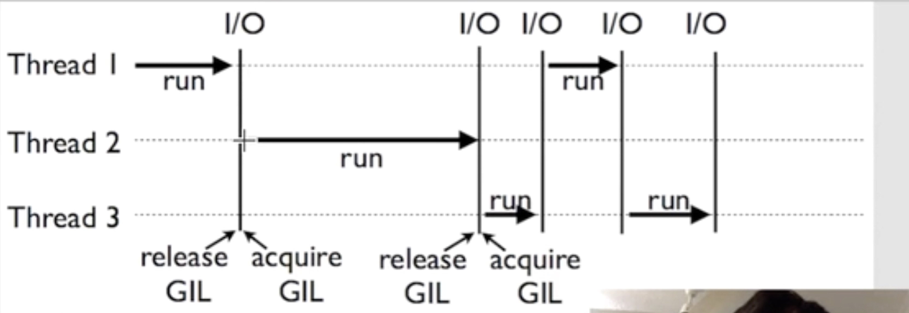
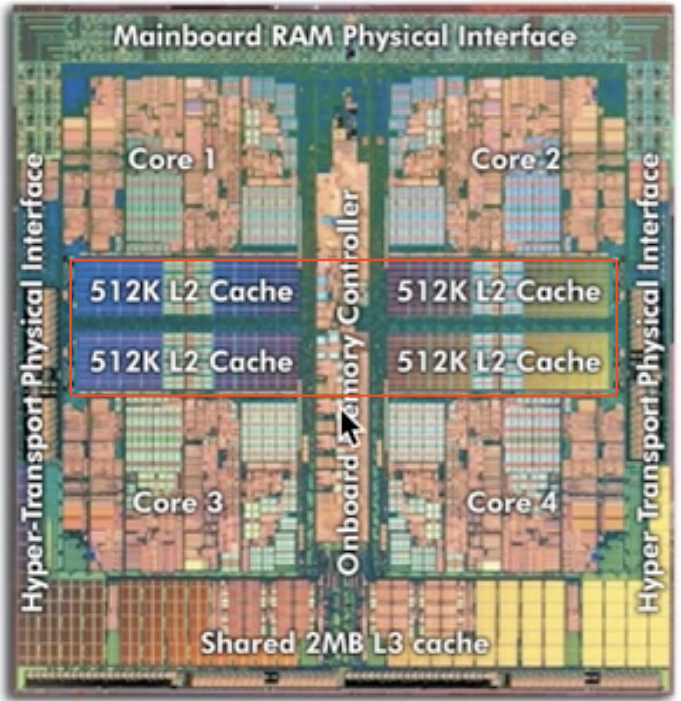

[TOC]

# python 学习资料

[Python Cookbook 3rd Edition Documentation](https://python3-cookbook.readthedocs.io/zh_CN/latest/index.html)

# thead

## gil(global interpreter lock)



> 这次我们来看看为什么说 python 的多线程 threading 有时候并不是特别理想. 最主要的原因是就是, Python 的设计上, 有一个必要的环节, 就是 Global Interpreter Lock (GIL). 这个东西让 Python 还是一次性只能处理一个东西.

> 我从这里摘抄了一段对于 GIL 的解释.

> 尽管Python完全支持多线程编程， 但是解释器的C语言实现部分在完全并行执行时并不是线程安全的。 实际上，解释器被一个全局解释器锁保护着，它确保任何时候都只有一个Python线程执行。 GIL最大的问题就是Python的多线程程序并不能利用多核CPU的优势 （比如一个使用了多个线程的计算密集型程序只会在一个单CPU上面运行）。

> 在讨论普通的GIL之前，有一点要强调的是GIL只会影响到那些严重依赖CPU的程序（比如计算型的）。 如果你的程序大部分只会涉及到I/O，比如网络交互，那么使用多线程就很合适， 因为它们大部分时间都在等待。实际上，你完全可以放心的创建几千个Python线程， 现代操作系统运行这么多线程没有任何压力，没啥可担心的。


## 使用 Lock 的情况

> lock在不同线程使用同一共享内存时，能够确保线程之间互不影响，使用lock的方法是， 在每个线程执行运算修改共享内存之前，执行lock.acquire()将共享内存上锁， 确保当前线程执行时，内存不会被其他线程访问，执行运算完毕后，使用lock.release()将锁打开， 保证其他的线程可以使用该共享内存

# multiprocessing

## 和threading 比较

> 多进程 Multiprocessing 和多线程 threading 类似, 他们都是在 python 中用来并行运算的. 不过既然有了 threading, 为什么 Python 还要出一个 multiprocessing 呢? 原因很简单, 就是用来弥补 threading 的一些劣势, 比如在 threading 教程中提到的GIL.

> 一般python只能在一个核或者一个线程中运算程序；多线程实际上还是让在计算机在同一时间只能处理一个线程。多核就可以避免这种情况，它可以把任务单独分配给每一个核，每一个核会有单独的运算空间

## queue 使用

> Queue的功能是将每个核或线程的运算结果放在队里中， 等到每个线程或核运行完毕后再从队列中取出结果， 继续加载运算。原因很简单, 多线程调用的函数不能有返回值, 所以使用Queue存储多个线程运算的结果


## Pool

> Pool默认调用是CPU的核数，传入processes参数可自定义CPU核数

> map() 放入迭代参数，返回多个结果

> apply_async()只能放入一组参数，并返回一个结果，如果想得到map()的效果需要通过迭代

## share memory



> 如上图，一个四核cpu的共享内存就存在中间红色的区域，如果想共享一个变量的话，可以通过global方式，放到多线程里面；但在多进程中间，如果输入一个global的变量，计算完是无法交流的，因此可是使用share memory。

### share value

> 我们可以通过使用Value数据存储在一个共享的内存表中

```python
import multiprocessing as mp

value1 = mp.Value('i', 0) 
value2 = mp.Value('d', 3.14)
```

### share array

> Array类，可以和共享内存交互，来实现在进程之间共享数据。这里的Array和numpy中的不同，它只能是一维的，不能是多维的

```python
array = mp.Array('i', [1, 2, 3, 4])
```

### 参考数据形式

```python
| Type code | C Type             | Python Type       | Minimum size in bytes |
| --------- | ------------------ | ----------------- | --------------------- |
| `'b'`     | signed char        | int               | 1                     |
| `'B'`     | unsigned char      | int               | 1                     |
| `'u'`     | Py_UNICODE         | Unicode character | 2                     |
| `'h'`     | signed short       | int               | 2                     |
| `'H'`     | unsigned short     | int               | 2                     |
| `'i'`     | signed int         | int               | 2                     |
| `'I'`     | unsigned int       | int               | 2                     |
| `'l'`     | signed long        | int               | 4                     |
| `'L'`     | unsigned long      | int               | 4                     |
| `'q'`     | signed long long   | int               | 8                     |
| `'Q'`     | unsigned long long | int               | 8                     |
| `'f'`     | float              | float             | 4                     |
| `'d'`     | double             | float             | 8                     |

```

