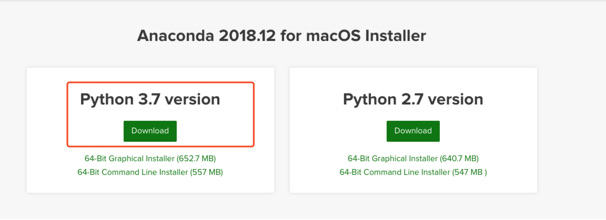
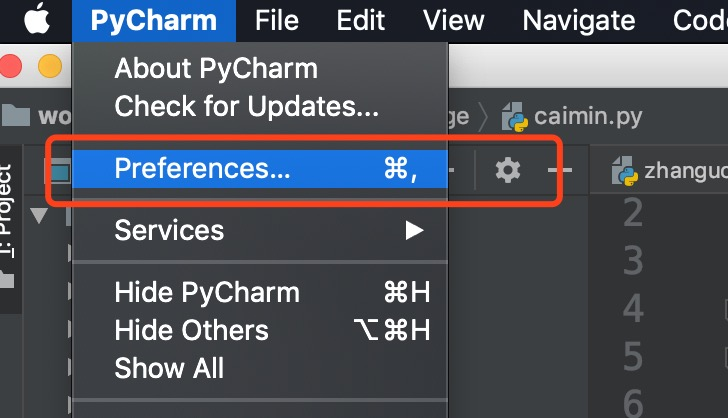
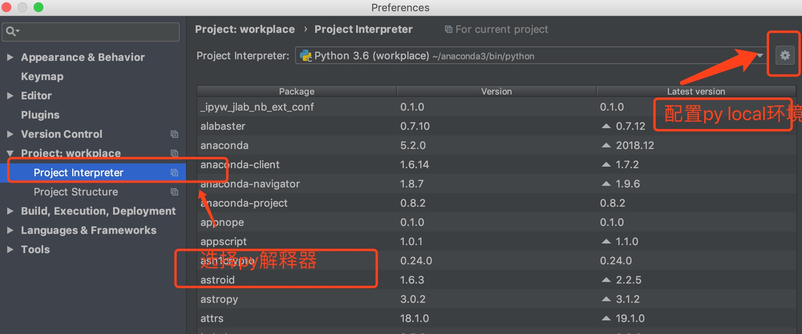
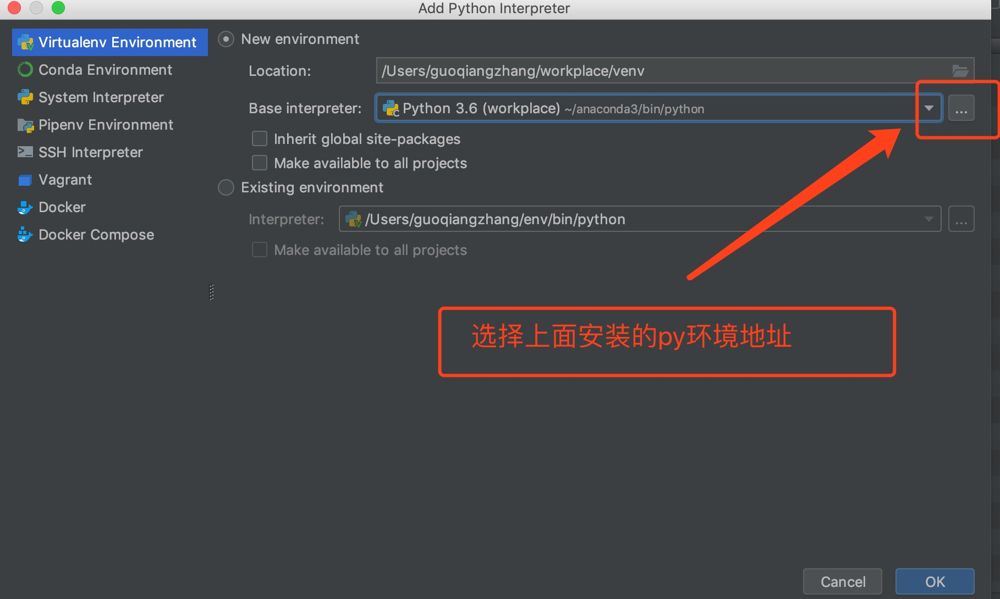

[TOC]

# mac python conda 环境配置

## 下载与安装
```bash
# 下载地址
https://www.anaconda.com/distribution/#macos

xxx.pkg 软件包双击后开始安装，和windowns下安装软件类似，每个步骤选择默认选项就可以，此处省略。。。


可能存在的问题：在终端输入conda 无法识别这个命令。

vi ~/.bash_profile

export PATH="/Users/anaconda3/bin:$PATH"（这里要填写自己的路径哦）

备注： /Users/anaconda3 为conda安装的目录，这个地址需要改成自己安装的地址。

:wq   # 这个是vi的退出命令

加载环境变量：

source ~/.bash_profile

再查看 conda list  ok啦~

```



## 配置国内软件包源


```bash
# conda 配置源(.condarc 文件没有的话，需要新建，同样可以使用vi 命令进行新建文件并写入内容)
cat ~/.condarc
channels:
    - https://mirrors.tuna.tsinghua.edu.cn/anaconda/pkgs/free/
    - defaults
show_channel_urls: true
```

## 基本使用

```bash
# 基本命令使用
conda env -h  	# 查看环境管理的全部命令帮助

conda list 	# 查看已经安装的软件包

conda list -n xxx  # 查看指定环境下的包

conda info -e   # 查看当前系统下的环境

conda search xxx 	# 查找包


# 安装软件包
conda install -n tf tensorflow==1.12.0

# 创建环境
conda create -n tf python=3.6
conda activate tf
conda deactivate

```

## 批量安装软件包

```bash

# 在~/requirement.txt 文件中写入如下软件包以及版本号
ipython==6.5.0
ipython-genutils==0.2.0
jieba==0.39
Markdown==2.6.11
matplotlib==2.2.3
numpy==1.15.4
pandas==0.23.4
Pillow==5.3.0
protobuf==3.6.0
requests==2.19.1
scikit-learn==0.20.0
scipy==1.1.0
tensorflow==1.9.0
termcolor==1.1.0
urllib3==1.23


# 使用conda命令进行安装
conda install --yes --file requirements.txt
```

##  pycharm中配置已经安装好的、自定义的python环境







记得每一步都需要点击ok
