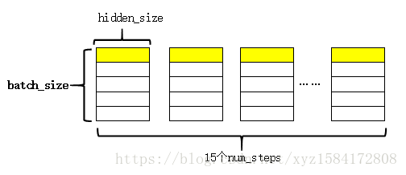
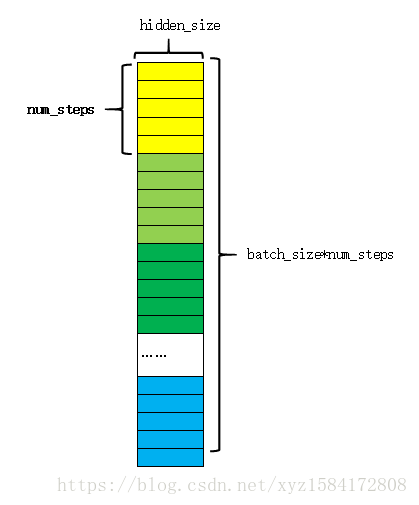

[TOC]

# tf 读取数据读取机制

## tf 读取数据三种方式

### 预加载数据

- 在tf 图中定义常量或者变量来保存所有数据(适用于数据量比较小的情况)

- 举例

```c++
// 
import tensorflow as tf
x1 = tf.constant([2,3,4])
x2 = tf.constant([4,0,1])

y = tf.add(x1,x2)

with tf.Session() as sess:
    print(sess.run(y))
```

### 数据供给(Feeding) - 使用placeholder读取内存中的数据

- 在tf程序运行的每一步，让python代码来供给数据

- 举例

```c++
import tensorflow as tf
x1 = tf.placeholder(tf.int32)
x2 = tf.placeholder(tf.int32)
// 用python产生数据
v1 = [2,3,4]
v2 = [4,0,1]

y = tf.add(x1,x2)

with tf.Session() as sess:
    print(sess.run(y,feed_dict={x1:v1,x2:v2}))    
```

### 从文件读取数据 - 使用queue读取硬盘中的数据

- 在tf图的起始，让一个输入管线从文件读取数据

### Dataset 高级API

- 支持从内存和硬盘中读取数据

[TensorFlow读取数据的几种方法以及队列的使用](https://www.cnblogs.com/zyly/p/8982335.html)

[TensorFlow全新的数据读取方式: Dataset API入门教程](https://zhuanlan.zhihu.com/p/30751039)

# tf.stack, tf.unstack

> stack 按axis方向堆叠, 例如axis=0, 按行进行堆叠; axis=1, 按列进行堆叠

> unstack 按axis方向拆成数组

```python
a = tf.constant([1,2,3])
b = tf.constant([4,5,6])

c = tf.stack([a,b], axis=0)
d = tf.stack([a,b], axis=1)

sess.run(c)
array([[1, 2, 3],
       [4, 5, 6]], dtype=int32)

sess.run(d)
array([[1, 4],
       [2, 5],
       [3, 6]], dtype=int32)
       
```

# name_scope and variable_scope

## 官方定义

> tf.name_scope create namespace for operators in the default graph (只给操作加前缀，更好管理操作命名空间)

> tf.variable_scope create namespace for both variables and operators in the default graph (给变量和操作同时加前缀)

> 和tf.get_variable配合使用，实现变量共享的功能

## 三种创建变量的方式

> tf.placeholder, tf.Variable, tf.get_variable

> 测试程序详见：tf_example/api/scope/three_create_variable_method.py

> 在tf.get_variable创建的变量之间会发生命名冲突

> 三种创建变量的方式用途分工明确：

> (1) tf.placeholder 占位符 trainable==False

> (2) tf.Variable 一般变量用这种方式定义。可选择trainable类型

> (3) tf.get_variable 一般和tf.variable_scope配合使用，实现变量共享功能。可选择 trainable类型

## name_scope, variable_scope

> tf.name_scope() 并不会对 tf.get_variable() 创建的变量有任何影响

> tf.name_scope() 主要是用来管理命名空间的，这样子让我们的整个模型更加有条理。而 tf.variable_scope() 的作用是为了实现变量共享，它和 tf.get_variable() 来完成变量共享的功能

> 测试程序： tf_example/api/scope/name_variable_scope.py


# tensorflow 损失函数

## tf.nn.sparse_softmax_cross_entropy_with_logits

```python
tf.nn.sparse_softmax_cross_entropy_with_logits(
    _sentinel=None,
    labels=None,
    logits=None,
    name=None
)
```


## tf.nn.sigmoid_cross_entropy_with_logits

```python
tf.nn.sigmoid_cross_entropy_with_logits(
    _sentinel=None,
    labels=None,
    logits=None,
    name=None
)
```

## tf.nn.nce_loss

```python
tf.nn.nce_loss(
    weights,
    biases,
    labels,
    inputs,
    num_sampled,
    num_classes,
    num_true=1,
    sampled_values=None,
    remove_accidental_hits=False,
    partition_strategy='mod',
    name='nce_loss'
)
```


## tf.nn.softmax_cross_entropy_with_logits

softmax和cross_entropy放在一起计算

```python

tf.nn.softmax_cross_entropy_with_logits(
    _sentinel=None,
    labels=None,
    logits=None,
    name=None
)

```

```python
import tensorflow as tf

logits = tf.constant([
    [1.0, 2.0, 3.0],
    [1.0, 2.0, 3.0],
    [1.0, 2.0, 3.0]
])

y = tf.nn.softmax(logits)

y_ = tf.constant([
    [0.0, 0.0, 1.0],
    [0.0, 0.0, 1.0],
    [0.0, 0.0, 1.0]
])

corss_entropy = -tf.reduce_sum(y_ * tf.log(y))


cross_entropy_2 = tf.reduce_sum(tf.nn.softmax_cross_entropy_with_logits_v2(logits=logits, labels=y_))

with tf.Session() as sess:
    print("y=", sess.run(y))
    print("y_ * tf.log(y)=", sess.run(y_ * tf.log(y)))
    print("tf.nn.softmax_cross_entropy_with_logits(logits=logits, labels=y_)=",
          sess.run(tf.nn.softmax_cross_entropy_with_logits_v2(logits=logits, labels=y_)))
    print("corss_entropy=", sess.run(corss_entropy))
    print("cross_entropy_2=", sess.run(cross_entropy_2))

"""
output:
y= [[0.09003057 0.24472848 0.66524094]
 [0.09003057 0.24472848 0.66524094]
 [0.09003057 0.24472848 0.66524094]]
y_ * tf.log(y)= [[-0.         -0.         -0.407606  ]
 [-0.         -0.         -0.407606  ]
 [-0.         -0.         -0.40760598]]
tf.nn.softmax_cross_entropy_with_logits(logits=logits, labels=y_)= [0.40760595 0.40760595 0.40760595]
corss_entropy= 1.222818
cross_entropy_2= 1.2228179
"""

```


## tf.contrib.legacy_seq2seq.sequence_loss_by_example 详解

### 简单实例

```python
import tensorflow as tf

logits = tf.random_normal([5, 4], dtype=tf.float32)
# targets维度和logits中第一个维度数据相等
targets = tf.constant([1, 2, 1, 3, 3], dtype=tf.int32)
# weights权重
weights = tf.ones([5], dtype=tf.float32)

outputs = tf.contrib.legacy_seq2seq.sequence_loss_by_example([logits], [targets], [weights])

with tf.Session() as sess:
    print("logits=", sess.run(logits))
    print("targets=", sess.run(targets))
    print("weights=", sess.run(weights))
    print("outputs=", sess.run(outputs))

"""
output:
logits= [[-1.1386268   0.8169078  -0.9967226   1.0999774 ]
 [-0.7205536  -1.9117556  -0.5325637   1.0633557 ]
 [-0.15136898 -0.9835274  -0.25090963 -0.08999465]
 [-0.11005739  0.58413076 -0.5154379  -1.3115659 ]
 [ 1.8486316  -0.24557243 -0.6538266  -0.45657474]]
targets= [1 2 1 3 3]
weights= [1. 1. 1. 1. 1.]
outputs= [2.1904864 0.8403204 2.4684677 0.9175795 3.4449625]
"""

```

### LSTM输出

batch_size=20,num_steps=15, cell_size=hidden_size=200,vocab_size=10000 因此LSTM每一步的输出维度为(batch_size, hidden_size)。
因为LSTM展开的时间步数为num_steps，于是通过 outputs.append(cell_output) 将每一时刻的输出都收集起来，最后的outputs是一个list，其样式为



图中黄色的部分表示同一个序列在LSTM不同时刻的输出。
紧接着对outputs进行拼接和reshape，其过程如下图：


将每一时刻的输出在第1维上拼接（上图），这样每一行就完整的表示了一个序列。reshape后的结构如下图



其中每一种颜色表示一个序列，同一种颜色中的各个块表示这个序列的不同时刻。
以上就是LSTM的输出，并对其适当变形。接下来通过一个全连接层，将每一时刻的输出映射成字典大小。

## 通过全连接层
这部分就是常见的y=wx+b的构造形式，通过以下代码实现：

```python
softmax_w = tf.get_variable( "softmax_w", [batch_size, vocab_size], dtype=tf.float32)
softmax_b = tf.get_variable("softmax_b", [vocab_size], dtype=tf.float32)
 # 网络的最后输出(相当于最后添加了一个全连接层)
logits = tf.matmul(output, softmax_w) + softmax_b   # logits shape = (batch_size*num_step,vocab_size)
```

通过全连接层后，得到logits，其维度为（batch_size * num_step, vocab_size），在本例中就是(300, 10000)（本例的词汇表大小是10000）。

### 执行tf.contrib.legacy_seq2seq.sequence_loss_by_example函数

```python
def sequence_loss_by_example(logits, targets, weights,
                             average_across_timesteps=True,
                             softmax_loss_function=None, name=None):
#logits: List of 2D Tensors of shape [batch_size x num_decoder_symbols].
#targets: List of 1D batch-sized int32 Tensors of the same length as logits.
#weights: List of 1D batch-sized float-Tensors of the same length as logits.
#return:log_pers 形状是 [batch_size].
   for logit, target, weight in zip(logits, targets, weights):
      if softmax_loss_function is None:
        # TODO(irving,ebrevdo): This reshape is needed because
        # sequence_loss_by_example is called with scalars sometimes, which
        # violates our general scalar strictness policy.
        target = array_ops.reshape(target, [-1])
        crossent = nn_ops.sparse_softmax_cross_entropy_with_logits(
            logit, target)
      else:
        crossent = softmax_loss_function(logit, target)
      log_perp_list.append(crossent * weight)
    log_perps = math_ops.add_n(log_perp_list)
    if average_across_timesteps:
      total_size = math_ops.add_n(weights) 
      total_size += 1e-12  # Just to avoid division by 0 for all-0 weights.
      log_perps /= total_size
  return log_perps
```

首先来看输入的数据： logits，targets，weights

logits数据的格式在前面已经介绍了，为（300, 10000）的矩阵，300为num_steps * batch_size得到，10000为词汇表大小，这个数据表示的意思是：每一行表示一个时刻（对应一个预测的单词），每num_steps行对应一个序列，一共有batch_size个num_steps行（因为这是一个batch_size大小的数据）。

输出targets的维度可以看到其形状为(batch_size,num_steps)即(20, 15)，表示的意思是，一个batch中有20条数据，而每一条数据有15个时间步，一个时间步对应一个单词。为了让预测的单词的顺序和targets中真实单词的顺序对应上，于是将targets的维度变成了（300，）即（20*15），这样一个元素对应logits中的一行，每15个数据就表示一个序列。

权重w（通常设置为1）

可以看到函数内部主要是调用sparse_softmax_cross_entropy_with_logits函数，然后再加权平均后返回。

那么这个sparse_softmax_cross_entropy_with_logits函数 将上面api实例。
于是，我们知道了，针对于一个logits元素和一个targets元素，比如这个例子中取logits[0]，其维度为（10000，），targets[0]，它就是单独的一个整型的数，表示单词在词汇表中的id号。先计算logits[0]中各个元素的相对概率（即计算softmax），然后利用交叉熵公式计算预测值和真实值之间的交叉熵。


### 结论
从tf.nn.sparse_softmax_cross_entropy_with_logits 实例中可以看出，tf.contrib.legacy_seq2seq.sequence_loss_by_example函数的计算过程就是在其内部的每个时间步中调用sparse_softmax_cross_entropy_with_logits函数即可

### reference

[实例](https://blog.csdn.net/UESTC_C2_403/article/details/72792889)

[sparse_softmax_cross_entropy_with_logits实例](https://blog.csdn.net/u012193416/article/details/77918732)

[tensorflow中sequence_loss_by_example()函数的计算过程（结合TF的ptb构建语言模型例子）](https://blog.csdn.net/xyz1584172808/article/details/83056179)


# 高级API

## 模型部分
[estimator example (iris_dnn) ](https://github.com/jizhang/tf-serve/blob/master/iris_dnn.py)

[鸢尾花深层神经网络分类器](http://shzhangji.com/cnblogs/2018/05/14/serve-tensorflow-estimator-with-savedmodel/)

[Tensorflow classifier.export_savedmodel](https://stackoverflow.com/questions/45640951/tensorflow-classifier-export-savedmodel-beginner)

[wals model for estimator](https://github.com/mayankk6196/training-data-analyst/blob/aa0a5d94f1dc4214294a13f4090b1c84998369fc/courses/machine_learning/deepdive/10_recommend/labs/walsmodel/model.py)

[TensorFlow 高级接口使用简介（estimator, keras， data, experiment）](https://www.cnblogs.com/arkenstone/p/8448208.html)

[Tensorflow模型保存与加载方法](http://lionheartwang.github.io/blog/2017/12/10/tensorflowmo-xing-bao-cun-yu-jia-zai-fang-fa/)

[TensorFlow Collaborative Filtering with Matrix Factorization](https://nbviewer.jupyter.org/github/cirocavani/tensorflow-jupyter/blob/master/workspace/Recommendation/ALS.ipynb)

[TensorFlow协同过滤推荐实战](https://cloud.tencent.com/developer/article/1097099)

[Matrix Factorization with Tensorflow](https://katbailey.github.io/post/matrix-factorization-with-tensorflow/)

[Matrix Factorization: A Simple Tutorial and Implementation in Python](http://www.albertauyeung.com/post/python-matrix-factorization/)

[推荐系列（四）：矩阵分解|Matrix Factorization](https://blog.csdn.net/uncle_ll/article/details/93905479)