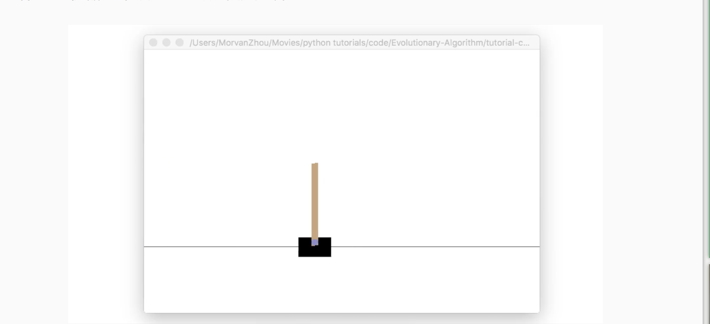

[TOC]

# 学习连接

莫烦的学习笔记

[一文学会用 Tensorflow 搭建神经网络](https://www.jianshu.com/p/e112012a4b2d)

[莫烦tensorflow](https://morvanzhou.github.io/tutorials/machine-learning/tensorflow/1-1-B-NN/)

[有趣的机器学习-莫烦](https://morvanzhou.github.io/tutorials/machine-learning/ML-intro/)

[Variational Autoencoders Explained](http://kvfrans.com/variational-autoencoders-explained/)

# Tensorflow 简介

## 人工神经网络 VS 生物神经网络


### 二者区别


> 人工神经网络靠的是正向和反向传播来更新神经元, 从而形成一个好的神经系统, 本质上, 这是一个能让计算机处理和优化的数学模型. 而生物神经网络是通过刺激, 产生新的联结, 让信号能够通过新的联结传递而形成反馈

## 神经网络 and 梯度下降

### Optimization


> 学习机器学习的同学们常会遇到这样的图像, 我了个天, 看上去好复杂, 哈哈, 不过还挺好看的. 这些和我们说的梯度下降又有什么关系呢? 原来这些图片展示出来了一个家族的历史, 这个家族的名字就是-”optimization” (优化问题). 优化能力是人类历史上的重大突破, 他解决了很多实际生活中的问题. 从而渐渐演化成了一个庞大的家族.

> 比如说牛顿法 (Newton’s method), 最小二乘法(Least Squares method), 梯度下降法 (Gradient Descent) 等等. 而我们的神经网络就是属于梯度下降法这个分支中的一个. 提到梯度下降, 我们不得不说说大学里面学习过的求导求微分. 因为这就是传说中”梯度下降”里面的”梯度” (gradient)啦. 


### 梯度下降


> 初学神经网络的时候, 我们通常会遇到这样一个方程, 叫做误差方程 (Cost Function). 用来计算预测出来的和我们实际中的值有多大差别. 在预测数值的问题中, 我们常用平方差 (Mean Squared Error) 来代替. 我们简化一下这个方程, W是我们神经网络中的参数, x, y 都是我们的数据, 因为 xy 都是实实在在的数据点, 在这个假设情况中, 是多少都无所谓, 然后我们再厚颜无耻地像这样继续简化一下, (注意, 这个过程在在数学中并不正确, 不过我们只是为了看效果), 所以现在误差值曲线就成了这样. 假设我们初始化的 W 在这个位置. 而这个位置的斜率是这条线, 这也就是梯度下降中的梯度啦. 我们从图中可以看出, Cost 误差最小的时候正是这条 cost 曲线最低的地方, 不过在蓝点的 W 却不知道这件事情, 他目前所知道的就是梯度线为自己在这个位置指出的一个下降方向, 我们就要朝着这个蓝色梯度的方向下降一点点. 在做一条切线, 发现我还能下降, 那我就朝着梯度的方向继续下降, 这时, 再展示出现在的梯度, 因为梯度线已经躺平了, 我们已经指不出哪边是下降的方向了, 所以这时我们就找到了 W 参数的最理想值. 简而言之, 就是找到梯度线躺平的点. 可是神经网络的梯度下降可没这么简单


> 神经网络中的 W 可不止一个, 如果只有一个 W, 我们就能画出之前那样的误差曲线, 如果有两个 W 也简单, 我们可以用一个3D 图来展示, 可是超过3个 W, 我们可就没办法很好的可视化出来啦. 这可不是最要命的. 在通常的神经网络中, 误差曲线可没这么优雅.


### 全局 and 局部最优


> 在简化版的误差曲线中, 我们只要找到梯度线躺平的地方, 就能能迅速找到误差最小时的 W. 可是很多情况是这样的, 误差曲线并不只有一个沟, 而且梯度躺平的点也不止一个. 不同的 W 初始化的位置, 将会带来不同的下降区域. 不同的下降区域, 又会带来不同的 W 解. 在这个图像当中, W 的全局最优解(Global minima)在这个位置, 而其它的 解都是局部最优(Local minima). 全局最优固然是最好, 但是很多时候, 你手中的都是一个局部最优解, 这也是无可避免的. 不过你可以不必担心, 因为虽然不是全局最优, 但是神经网络也能让你的局部最优足够优秀, 以至于即使拿着一个局部最优也能出色的完成手中的任务.

### 实例
```python

import tensorflow as tf
import numpy as np
import matplotlib.pyplot as plt
from mpl_toolkits.mplot3d import Axes3D


LR = 0.1
# LR = 1.
REAL_PARAMS = [1.2, 2.5]
INPUT_PARAMS = [
    [5, 4],
    [5, 1],
    [2, 4.5]][0]

x = np.linspace(-1, 1, 200, dtype=np.float32)

# ############################################################################################################
# test1
# y_fun = lambda a, b: a * x + b
# tf_y_fun = lambda a, b: a * x + b

# ############################################################################################################
# test2
# y_fun = lambda a, b: a * x ** 3 + b * x ** 2
# tf_y_fun = lambda a, b: a * x ** 3 + b * x ** 2

# ############################################################################################################
# test3
y_fun = lambda a, b: np.sin(b * np.cos(a * x))
tf_y_fun = lambda a, b: tf.sin(b * tf.cos(a * x))

noise = np.random.randn(200)/10
y = y_fun(*REAL_PARAMS) + noise

# print("noise: ", noise)
# print("y: ", y)
print("INPUT_PARAMS: ", INPUT_PARAMS)

# tensorflow graph
a, b = [tf.Variable(initial_value=p, dtype=tf.float32) for p in INPUT_PARAMS]
pred = tf_y_fun(a, b)
mse = tf.reduce_mean(tf.square(y - pred))
train_op = tf.train.GradientDescentOptimizer(LR).minimize(mse)

a_list, b_list, cost_list = [], [], []
with tf.Session() as sess:
    init = tf.global_variables_initializer()
    sess.run(init)
    for i in range(400):
        a_, b_, mse_ = sess.run([a, b, mse])
        a_list.append(a_)
        b_list.append(b_)
        cost_list.append(mse_)                          # record parameter changes
        result, _ = sess.run([pred, train_op])          # training

# visualization codes
plt.figure(1)
plt.scatter(x, y, c='b')    # plot data
plt.plot(x, result, 'r-', lw=2)     # plot line fitting

# 3D cost figure
fig = plt.figure(2)
ax = Axes3D(fig)
a3D, b3D = np.meshgrid(np.linspace(-2, 7, 30), np.linspace(-2, 7, 30))  # parameter space
cost3D = np.array([np.mean(np.square(y_fun(a_, b_) - y)) for a_, b_ in zip(a3D.flatten(), b3D.flatten())]).reshape(a3D.shape)
ax.plot_surface(a3D, b3D, cost3D, rstride=1, cstride=1, cmap=plt.get_cmap('rainbow'), alpha=0.5)
ax.scatter(a_list[0], b_list[0], zs=cost_list[0], s=300, c='r')     # initial parameter place
ax.set_xlabel('a')
ax.set_ylabel('b')
ax.plot(a_list, b_list, zs=cost_list, zdir='z', c='r', lw=3)        # plot 3D gradient descent

plt.show()
```

#### 普通的梯度下降
```python
# test 1
y_fun = lambda a, b: a * x + b
tf_y_fun = lambda a, b: a * x + b

```


看上去他从最开始的红点, 很顺利的滑落到了误差最小的地方. 梯度下降圆满完成.如果我们来尝试不同的学习效率呢, 比如调整最开始的 LR=1, 就会发生下面这样的事.


貌似这时的梯度下降变得纠结起来, 梯度下不去了. 原来这就是因为学习效率过大的原因, 导致虽然学得快, 但是没办法收敛. 我们也能从学习到的预测线看出来这样的现象, 现在下面的预测线没有办法预测出真实数据了. 所以切记, 当你的模型没办法收敛的时候, 试试调低学习率.


#### 为模型,公式调参
接下来我们看看 Tensorflow 的另一种用途, 为公式调参. 说到底, 神经网络就是用梯度下降, 而梯度下降就是一种优化模式 具体参考我制作的这个短视频. 所以我们也可以使用 Tensorflow 的梯度下降机制来调参. 比如我们将上面的提到的 y_fun 和 tf_y_fun 改成下面这样 (其实上面也是在调参).

```python
# test 2
y_fun = lambda a, b: a * x**3 + b * x**2
tf_y_fun = lambda a, b: a * x**3 + b * x**2

```
现在有点像一个经验公式了吧. 其实很多时候, 人们总结出来的经验公式其实是很有用的, 我们没必要大费周章来使用神经网络处理所有问题, 首先遇到一个问题, 你要想的是, 在这个问题中, 是否以前有人提出过什么经验公式的, 那我来对这个经验公式调调参. 这可比神经网络方便多了. 而且梯度下降调参只是调参中的一种方式, 还有很多种调参方式, 具体可以看看和使用 python 的另一个模块 scipy 中的 optimization 链接.
好了, 如果你决定用梯度下降调参, 这份代码就是一种途径. 代码的其他部分不用过多更改. 我们直接来看效果吧. 首先看看数据点和拟合参数a, b 后的曲线.


#### 局部最优,全局最优
在回到神经网络的话题中来, 多层的有激活神经网络必定有很多局部最优解的. 我在这个短视频中也提过什么是全局最优和局部最优. 那么我们就来做一个有两个参数的简单神经网络吧. 同样, 我们至于要修改 y_fun 和 tf_y_fun 就好了:

```python
# test3
y_fun = lambda a, b: np.sin(b*np.cos(a*x))
tf_y_fun = lambda a, b: tf.sin(b*tf.cos(a*x))
```
想象 np.cos(a*x) 是有激活的一层神经层, np.sin(b*last_layer) 是有激活的第二层. 那么这个方程就是最简单的一种两层神经网络了. 如果使用的初始参数点是 INIT_PARAMS=[2, 4.5] 他的数据点和拟合曲线是下面这样:


他的梯度下降空间就是我们最开始看到的那个


从初始的 INIT_PARAMS=[2, 4.5] 这个点开始梯度下降, 我们就能成功的找到接近全局最优的 a=1.2; b=2.5, 但是这个3D 图上有很多局部最优点, 如果我们换一个初始参数位置, 比如 INIT_PARAMS=[5, 1]. 那么就会下降到一个最靠近他的局部最优.


这样, 我们的模型就只能止步在这, 而且并不能继续向前拟合数据点了. 所以可以看出参数的初始化位置的确很重要.


通常, 在初始化神经网络的参数时, 我们可以用到 Normal distribution 等方式, 并且多做几次初始化实验, 看看效果如何. 运气好的时候, 初始化很成功, 带来的比较好的局部最优, 运气不好的时候.. 你懂的.. 继续做实验吧.

## 科普：神经网络的黑盒不黑

### 黑盒


> 当然, 这可不是人类的神经网络, 因为至今我们都还没彻底弄懂人类复杂神经网络的运行方式. 今天只来说说计算机中的人工神经网络. 我们都听说过, 神经网络是一个黑盒.


> 正好我手边有一个手电筒, 我们打开黑盒好好照亮看看. 一般来说, 神经网络是一连串神经层所组成的把输入进行加工再输出的系统. 中间的加工过程就是我们所谓的黑盒. 想把黑盒打开, 就是把神经网络给拆开. 按正常的逻辑, 我们能将神经网络分成三部分,

### 神经网络分区


> 输入端, 黑盒, 输出端. 输入端是我们能理解的物体, 一个宝宝, 输出端也是一个我们能理解的物体, 一个奶瓶. 对于神经网络, 传统的理解就是, 中间的这两层神经层在对输入信息进行加工, 好让自己的输出信息和奶瓶吻合. 但是我们如果换一个角度来想想. 此时, 我们将左边的红线移动一下

> 现在的输入端增加了一层, 原本我们认定为黑盒的一部分被照亮, 变成了一个已知部分. 我们将最左边两层的神经层共同看成输入端. 貌似怪怪的, 你可能会问: “可是这时的输入端不再是我们知道的”宝宝”了呀, 为什么可以这样看?” 想得没错, 它的确已经不是我们认识的宝宝啦, 但是”宝宝”这个人类定义的形象通过了一层神经网络加工, 变成了另外一种宝宝的形象,可能这种形象我们用肉眼看起来并不像宝宝, 不过计算机却能理解, 这是它所能识别的”宝宝”形象. 在专业术语中, 我们将宝宝当做特征(features), 将神经网络第一层加工后的宝宝叫做代表特征(feature representation). 如果再次移动红线, 我们的黑盒就消失了, 这时原本在黑盒里的所有神经层都被照亮. 原本的代表特征再次被加工, 变成了另一种代表特征, 同样, 再次加工形成的代表特征通常只有计算机自己看得懂, 能够理解. 所以, 与其说黑盒是在加工处理, 还不如说是在将一种代表特征转换成另一种代表特征, 一次次特征之间的转换, 也就是一次次的更有深度的理解. 比如神经网络如果接收人类手写数字的图片.

### 举例


> 然后我们将这个神经网络的输出层给拆掉, 只留下前三层, 那第3层输出的信息就是我们这些数字的3个最重要的代表特征, 换句话说, 就是用3个信息来代表整张手写数字图片的所有像素点. 我们如果把这3个信息展示出来, 我们就能很清楚的看到, 计算机是如何用3个点来代表不同的数字内容, 比如神经网络认为 1 和 0 是完全不同的, 所以他们应该被放在空间里不同的地方. 输出层就更好理解了,


> 有了用3个点表示的数字代表特征, 我们就能整理整理, 将落在相同区域的数字分为一类, 如果落在了那些1所在的区域, 我们就认定张手写图片就是1, 如果是2的区域, 就认定为2. 这就是神经网络的黑盒并不黑的原因啦, 只是因为有时候代表特征太多了,我们人类没有办法看懂他们代表的是什么, 然而计算机却能看清楚它所学到的规律, 所以我们才觉得神经网络就是个黑盒. 这种代表特征的理解方式其实非常有用, 以至于人们拿着它来研究更高级的神经网络玩法. 比如迁移学习(Transfer Learning). 我们举一个例子.

### 迁移学习


> 对于一个有分类能力的神经网络, 有时候我们只需要这套神经网络的理解能力, 并拿这种能力去处理其他问题. 所以我们保留它的代表特征转换能力. 因为有了这种能力, 就能将复杂的图片像素信息转换成更少量, 但更精辟的信息, 比如刚刚我们说将手写数字变成的3个点信息. 然后我们需要干点坏事, 将这个神经网络的输出层给拆掉. 套上另外一个神经网络, 用这种移植的方式再进行训练, 让它处理不同的问题, 比如, 预测照片里事物的价值. 现在看来, 这黑盒里开个灯, 其实还挺有用的嘛. 当你看不懂神经网络的时候, 这样想想, 是不是更好理解啦.

## 神经网络在做什么

### 拟合曲线


> 机器学习 其实就是让电脑不断的尝试模拟已知的数据. 他能知道自己拟合的数据离真实的数据差距有多远, 然后不断地改进自己拟合的参数,提高拟合的相似度.

> 本例中蓝色离散点是我们的数据点, 红线是通过神经网络算法拟合出来的曲线


> 它是对我们数据点的一个近似表达. 可以看出, 在开始阶段, 红线的表达能力不强, 误差很大. 不过通过不断的学习, 预测误差将会被降低. 所以学习到后来. 红线也能近似表达出数据的样子.


### 拟合参数

> 如果红色曲线的表达式为：y = a*x + b 其中x代表inputs, y代表outputs, a和b是神经网络训练的参数. 模型训练好了以后,a和b的值将会被确定, 比如 a=0.5, b=2,当我们再输入x=3时, 我们的模型就会输出 0.5*3 + 2 的结果. 模型通过学习数据, 得到能表达数据的参数, 然后对我们另外给的数据所作出预测.


# tf 基础架构

## 处理结构

### 计算图

> Tensorflow 首先要定义神经网络的结构, 然后再把数据放入结构当中去运算和 training.

> 因为TensorFlow是采用数据流图（data　flow　graphs）来计算, 所以首先我们得创建一个数据流流图, 然后再将我们的数据（数据以张量(tensor)的形式存在）放在数据流图中计算. 节点（Nodes）在图中表示数学操作,图中的线（edges）则表示在节点间相互联系的多维数据数组, 即张量（tensor). 训练模型时tensor会不断的从数据流图中的一个节点flow到另一节点, 这就是TensorFlow名字的由来

### 张量

> 张量（Tensor):

> 张量有多种. 零阶张量为 纯量或标量 (scalar) 也就是一个数值. 比如 [1]
一阶张量为 向量 (vector), 比如 一维的 [1, 2, 3]
二阶张量为 矩阵 (matrix), 比如 二维的 [[1, 2, 3],[4, 5, 6],[7, 8, 9]]
以此类推, 还有 三阶 三维的 …


## activation function（激活函数）

### 非线性方程


> 我们为什么要使用激励函数? 用简单的语句来概括. 就是因为, 现实并没有我们想象的那么美好, 它是残酷多变的. 哈哈, 开个玩笑, 不过激励函数也就是为了解决我们日常生活中 不能用线性方程所概括的问题. 好了,我知道你的问题来了. 什么是线性方程 (linear function)?

> 说到线性方程, 我们不得不提到另外一种方程, 非线性方程 (nonlinear function). 我们假设, 女生长得越漂亮, 越多男生爱. 这就可以被当做一个线性问题. 但是如果我们假设这个场景是发生在校园里. 校园里的男生数是有限的, 女生再漂亮, 也不可能会有无穷多的男生喜欢她. 所以这就变成了一个非线性问题.再说..女生也不可能是无穷漂亮的. 这个问题我们以后有时间私下讨论.


> 然后我们就可以来讨论如何在神经网络中达成我们描述非线性的任务了. 我们可以把整个网络简化成这样一个式子. Y = Wx, W 就是我们要求的参数, y 是预测值, x 是输入值. 用这个式子, 我们很容易就能描述刚刚的那个线性问题, 因为 W 求出来可以是一个固定的数. 不过这似乎并不能让这条直线变得扭起来 , 激励函数见状, 拔刀相助, 站出来说道: “让我来掰弯它!”

### 激活函数


> 这里的 AF 就是指的激励函数. 激励函数拿出自己最擅长的”掰弯利器”, 套在了原函数上 用力一扭, 原来的 Wx 结果就被扭弯了.

> 其实这个 AF, 掰弯利器, 也不是什么触不可及的东西. 它其实就是另外一个非线性函数. 比如说relu, sigmoid, tanh. 将这些掰弯利器嵌套在原有的结果之上, 强行把原有的线性结果给扭曲了. 使得输出结果 y 也有了非线性的特征. 举个例子, 比如我使用了 relu 这个掰弯利器, 如果此时 Wx 的结果是1, y 还将是1, 不过 Wx 为-1的时候, y 不再是-1, 而会是0.

> 你甚至可以创造自己的激励函数来处理自己的问题, 不过要确保的是这些激励函数必须是可以微分的, 因为在 backpropagation 误差反向传递的时候, 只有这些可微分的激励函数才能把误差传递回去.


### 常用选择


> 想要恰当使用这些激励函数, 还是有窍门的. 比如当你的神经网络层只有两三层, 不是很多的时候, 对于隐藏层, 使用任意的激励函数, 随便掰弯是可以的, 不会有特别大的影响. 不过, 当你使用特别多层的神经网络, 在掰弯的时候, 玩玩不得随意选择利器. 因为这会涉及到梯度爆炸, 梯度消失的问题. 因为时间的关系, 我们可能会在以后来具体谈谈这个问题.

> 最后我们说说, 在具体的例子中, 我们默认首选的激励函数是哪些. 在少量层结构中, 我们可以尝试很多种不同的激励函数. 在卷积神经网络 Convolutional neural networks 的卷积层中, 推荐的激励函数是 relu. 在循环神经网络中 recurrent neural networks, 推荐的是 tanh 或者是 relu (这个具体怎么选, 我会在以后 循环神经网络的介绍中在详细讲解).


# 建立第一个神经网络

## 加速神经网络训练

[英文学习资料](http://sebastianruder.com/optimizing-gradient-descent/)

[cs231n](http://cs231n.github.io/neural-networks-3/)

[Ftrl](https://www.eecs.tufts.edu/~dsculley/papers/ad-click-prediction.pdf)

[Module: tf.train](https://www.tensorflow.org/api_docs/python/tf/train)

### Stochastic Gradient Descent (SGD)


> 所以, 最基础的方法就是 SGD 啦, 想像红色方块是我们要训练的 data, 如果用普通的训练方法, 就需要重复不断的把整套数据放入神经网络 NN训练, 这样消耗的计算资源会很大.

> 我们换一种思路, 如果把这些数据拆分成小批小批的, 然后再分批不断放入 NN 中计算, 这就是我们常说的 SGD 的正确打开方式了. 每次使用批数据, 虽然不能反映整体数据的情况, 不过却很大程度上加速了 NN 的训练过程, 而且也不会丢失太多准确率.如果运用上了 SGD, 你还是嫌训练速度慢, 那怎么办?


> 没问题, 事实证明, SGD 并不是最快速的训练方法, 红色的线是 SGD, 但它到达学习目标的时间是在这些方法中最长的一种. 我们还有很多其他的途径来加速训练

### Momentum


> 大多数其他途径是在更新神经网络参数那一步上动动手脚. 传统的参数 W 的更新是把原始的 W 累加上一个负的学习率(learning rate) 乘以校正值 (dx). 这种方法可能会让学习过程曲折无比, 看起来像 喝醉的人回家时, 摇摇晃晃走了很多弯路.


> 所以我们把这个人从平地上放到了一个斜坡上, 只要他往下坡的方向走一点点, 由于向下的惯性, 他不自觉地就一直往下走, 走的弯路也变少了. 这就是 Momentum 参数更新. 另外一种加速方法叫AdaGrad.

### AdaGrad 更新方法


> 这种方法是在学习率上面动手脚, 使得每一个参数更新都会有自己与众不同的学习率, 他的作用和 momentum 类似, 不过不是给喝醉酒的人安排另一个下坡, 而是给他一双不好走路的鞋子, 使得他一摇晃着走路就脚疼, 鞋子成为了走弯路的阻力, 逼着他往前直着走. 他的数学形式是这样的. 接下来又有什么方法呢? 如果把下坡和不好走路的鞋子合并起来, 是不是更好呢? 没错, 这样我们就有了 RMSProp 更新方法

### RMSProp 更新方法


> 有了 momentum 的惯性原则 , 加上 adagrad 的对错误方向的阻力, 我们就能合并成这样. 让 RMSProp同时具备他们两种方法的优势. 不过细心的同学们肯定看出来了, 似乎在 RMSProp 中少了些什么. 原来是我们还没把 Momentum合并完全, RMSProp 还缺少了 momentum 中的 这一部分. 所以, 我们在 Adam 方法中补上了这种想法.

### Adam 更新方法


> 计算m 时有 momentum 下坡的属性, 计算 v 时有 adagrad 阻力的属性, 然后再更新参数时 把 m 和 V 都考虑进去. 实验证明, 大多数时候, 使用 adam 都能又快又好的达到目标, 迅速收敛. 所以说, 在加速神经网络训练的时候, 一个下坡, 一双破鞋子, 功不可没

# tensorboard

# 高阶内容

## CNN

[Google 的 CNN 教程](https://classroom.udacity.com/courses/ud730/lessons/6377263405/concepts/63796332430923)


### 什么是卷积神经网络CNN(Convolutional Neural Network)


> 卷积神经网络是近些年逐步兴起的一种人工神经网络结构, 因为利用卷积神经网络在图像和语音识别方面能够给出更优预测结果, 这一种技术也被广泛的传播可应用. 卷积神经网络最常被应用的方面是计算机的图像识别, 不过因为不断地创新, 它也被应用在视频分析, 自然语言处理, 药物发现, 等等. 近期最火的 Alpha Go, 让计算机看懂围棋, 同样也是有运用到这门技术.


#### 卷积和神经网络


> 我们来具体说说卷积神经网络是如何运作的吧, 举一个识别图片的例子, 我们知道神经网络是由一连串的神经层组成,每一层神经层里面有存在有很多的神经元. 这些神经元就是神经网络识别事物的关键. 每一种神经网络都会有输入输出值, 当输入值是图片的时候, 实际上输入神经网络的并不是那些色彩缤纷的图案,而是一堆堆的数字. 就比如说这个. 当神经网络需要处理这么多输入信息的时候, 也就是卷积神经网络就可以发挥它的优势的时候了. 那什么是卷积神经网络呢?


> 我们先把卷积神经网络这个词拆开来看. “卷积” 和 “神经网络”. ** 卷积也就是说神经网络不再是对每个像素的输入信息做处理了,而是图片上每一小块像素区域进行处理, 这种做法加强了图片信息的连续性. 使得神经网络能看到图形, 而非一个点. 这种做法同时也加深了神经网络对图片的理解. ** 具体来说, 卷积神经网络有一个批量过滤器, 持续不断的在图片上滚动收集图片里的信息,每一次收集的时候都只是收集一小块像素区域, 然后把收集来的信息进行整理, 这时候整理出来的信息有了一些实际上的呈现, 比如这时的神经网络能看到一些边缘的图片信息, 然后在以同样的步骤, 用类似的 ** 批量过滤器扫过产生的这些边缘信息, 神经网络从这些边缘信息里面总结出更高层的信息结构,比如说总结的边缘能够画出眼睛,鼻子 ** 等等. 再经过一次过滤, 脸部的信息也从这些眼睛鼻子的信息中被总结出来. 最后我们再把这些信息套入几层普通的全连接神经层进行分类, 这样就能得到输入的图片能被分为哪一类的结果了.


> 我们截取一段 google 介绍卷积神经网络的视频, 具体说说图片是如何被卷积的. 下面是一张猫的图片, 图片有长, 宽, 高 三个参数. 对! 图片是有高度的! 这里的高指的是计算机用于产生颜色使用的信息. 如果是黑白照片的话, 高的单位就只有1, 如果是彩色照片, 就可能有红绿蓝三种颜色的信息, 这时的高度为3. 我们以彩色照片为例子. 过滤器就是影像中不断移动的东西, 他不断在图片收集小批小批的像素块, 收集完所有信息后, 输出的值, 我们可以理解成是一个 ** 高度更高,长和宽更小的”图片” . 这个图片里就能包含一些边缘信息. 然后以同样的步骤再进行多次卷积, 将图片的长宽再压缩, 高度再增加, 就有了对输入图片更深的理解. 将压缩,增高的信息嵌套在普通的分类神经层上,我们就能对这种图片进行分类了. **


#### 池化(Pooling)


> 研究发现, ** 在每一次卷积的时候, 神经层可能会无意地丢失一些信息. 这时, 池化 (pooling) 就可以很好地解决这一问题. 而且池化是一个筛选过滤的过程, 能将 layer 中有用的信息筛选出来, 给下一个层分析. 同时也减轻了神经网络的计算负担 **  [具体细节参考](http://cs231n.github.io/convolutional-networks/#pool). 也就是说在卷集的时候, 我们不压缩长宽, 尽量地保留更多信息, 压缩的工作就交给池化了,这样的一项附加工作能够很有效的提高准确性. 有了这些技术,我们就可以搭建一个属于我们自己的卷积神经网络啦.

> 卷积神经网络包含输入层、隐藏层和输出层，** 隐藏层又包含卷积层和pooling层，图像输入到卷积神经网络后通过卷积来不断的提取特征，每提取一个特征就会增加一个feature map，所以会看到视频教程中的立方体不断的增加厚度，那么为什么厚度增加了但是却越来越瘦了呢，哈哈这就是pooling层的作用喽，pooling层也就是下采样，通常采用的是最大值pooling和平均值pooling，因为参数太多喽，所以通过pooling来稀疏参数，使我们的网络不至于太复杂 ** 。

#### 流行的 CNN 结构 


> 比较流行的一种搭建结构是这样, 从下到上的顺序, 首先是输入的图片(image), 经过一层卷积层 (convolution), 然后在用池化(pooling)方式处理卷积的信息, 这里使用的是 max pooling 的方式. 然后在经过一次同样的处理, 把得到的第二次处理的信息传入两层全连接的神经层 (fully connected),这也是一般的两层神经网络层,最后在接上一个分类器(classifier)进行分类预测. 这仅仅是对卷积神经网络在图片处理上一次简单的介绍. 如果你想知道使用 python 搭建这样的卷积神经网络, 欢迎点击下面的内容.


## RNN

> 对于序列数据的预测, 顺序排列是很重要. 我们可以预测下一个按照一定顺序排列的字, 但是打乱顺序, 我们就没办法分析自己到底在说什么了

### 学习资料

[rnns-in-tensorflow-a-practical-guide-and-undocumented-features](http://www.wildml.com/2016/08/rnns-in-tensorflow-a-practical-guide-and-undocumented-features/)

[Tensorflow 的 bptt 形式理解](https://r2rt.com/styles-of-truncated-backpropagation.html)

### 什么是循环神经网络RNN(recurrent neural network)

#### 序列数据 


> 我们想象现在有一组序列数据 data 0,1,2,3. 在当预测 result0 的时候,我们基于的是 data0, 同样在预测其他数据的时候, 我们也都只单单基于单个的数据. 每次使用的神经网络都是同一个 NN. 不过这些数据是有关联 顺序的 , 就像在厨房做菜, 酱料 A要比酱料 B 早放, 不然就串味了. 所以普通的神经网络结构并不能让 NN 了解这些数据之间的关联.


#### 处理序列数据的神经网络


> 那我们如何让数据间的关联也被 NN 加以分析呢? 想想我们人类是怎么分析各种事物的关联吧, 最基本的方式,就是记住之前发生的事情. 那我们让神经网络也具备这种记住之前发生的事的能力. 再分析 Data0 的时候, 我们把分析结果存入记忆. 然后当分析 data1的时候, NN会产生新的记忆, 但是新记忆和老记忆是没有联系的. 我们就简单的把老记忆调用过来, 一起分析. 如果继续分析更多的有序数据 , RNN就会把之前的记忆都累积起来, 一起分析


> 我们再重复一遍刚才的流程, 不过这次是以加入一些数学方面的东西. 每次 RNN 运算完之后都会产生一个对于当前状态的描述 , state. 我们用简写 S( t) 代替, 然后这个 RNN开始分析 x(t+1) , 他会根据 x(t+1)产生s(t+1), 不过此时 y(t+1) 是由 s(t) 和 s(t+1) 共同创造的. 所以我们通常看到的 RNN 也可以表达成这种样子.


> 序列数据X1,X2,X3,X4,输出为Y1,Y2,Y3,Y4, W1,W2,W3,W4分别为四个神经网络作为共享的滤波器，因此可以抽象为只有一个，叫做Cell，当扫过X1的时候，会将一部分信息已经存到Cell；当扫过X2的时候，在提取Cell中的X1的记忆信息，此部分记忆和新输入的数据X2，在输出Y2，因此，Y2的输出不仅仅考虑X2，还有上一部分的X1的数据，是对X1和X2的一个总结


### 什么是LSTM循环神经网络

#### RNN弊端


> 之前我们说过, RNN 是在有顺序的数据上进行学习的. 为了记住这些数据, RNN 会像人一样产生对先前发生事件的记忆. 不过一般形式的 RNN 就像一个老爷爷, 有时候比较健忘. 为什么会这样呢?


> 想像现在有这样一个 RNN, 他的输入值是一句话: ‘我今天要做红烧排骨, 首先要准备排骨, 然后…., 最后美味的一道菜就出锅了’, shua ~ 说着说着就流口水了. 现在请 RNN 来分析, 我今天做的到底是什么菜呢. RNN可能会给出“辣子鸡”这个答案. 由于判断失误, RNN就要开始学习 这个长序列 X 和 ‘红烧排骨’ 的关系 , 而RNN需要的关键信息 ”红烧排骨”却出现在句子开头,


> 再来看看 RNN是怎样学习的吧. 红烧排骨这个信息原的记忆要进过长途跋涉才能抵达最后一个时间点. 然后我们得到误差, 而且在 反向传递 得到的误差的时候, 他在每一步都会 乘以一个自己的参数 W. 如果这个 W 是一个小于1 的数, 比如0.9. 这个0.9 不断乘以误差, 误差传到初始时间点也会是一个接近于零的数, 所以对于初始时刻, 误差相当于就消失了. 我们把这个问题叫做梯度消失或者梯度弥散 ** Gradient vanishing ** . 反之如果 W 是一个大于1 的数, 比如1.1 不断累乘, 则到最后变成了无穷大的数, RNN被这无穷大的数撑死了, 这种情况我们叫做剃度爆炸, ** Gradient exploding **. 这就是普通 RNN 没有办法回忆起久远记忆的原因.


### LSTM


> LSTM 是为两解决普通RNN 梯度爆炸和消失问题。
> 输入的时候有一个输入Gate,目的是考虑是否将此input写入到Memory中，Gate是一个参数是可以被训练的;
> 输出的时候是要读取Memory
> 遗忘Gate是考虑是不是要忘记之前的Memory。通过三个门可以很好的控制Gradient vanishing or Gradient exploding


> LSTM 就是为了解决这个问题而诞生的. LSTM 和普通 RNN 相比, 多出了三个控制器. (输入控制, 输出控制, 忘记控制). 现在, LSTM RNN 内部的情况是这样.

> 他多了一个 控制全局的记忆, 我们用粗线代替. 为了方便理解, 我们把粗线想象成电影或游戏当中的 主线剧情. 而原本的 RNN 体系就是 分线剧情. 三个控制器都是在原始的 RNN 体系上, 我们先看 输入方面 , 如果此时的分线剧情对于剧终结果十分重要, 输入控制就会将这个分线剧情按重要程度 写入主线剧情 进行分析. 再看 忘记方面, 如果此时的分线剧情更改了我们对之前剧情的想法, 那么忘记控制就会将之前的某些主线剧情忘记, 按比例替换成现在的新剧情. 所以 主线剧情的更新就取决于输入 和忘记 控制. 最后的输出方面, 输出控制会基于目前的主线剧情和分线剧情判断要输出的到底是什么.基于这些控制机制, LSTM 就像延缓记忆衰退的良药, 可以带来更好的结果.


## AutoEncoder

### 什么是自编码器(AutoEncoder)


Autoencoder 简单来说就是将有很多Feature的数据进行压缩，之后再进行解压的过程。 本质上来说，它也是一个对数据的 ** 非监督学习** ，如果大家知道 PCA (Principal component analysis)， 与 Autoencoder 相类似，它的主要功能即对数据进行非监督学习，并将压缩之后得到的“特征值”，这一中间结果正类似于PCA的结果。 之后再将压缩过的“特征值”进行解压，得到的最终结果与原始数据进行比较，对此进行非监督学习。

#### 压缩与解压


有一个神经网络, 它在做的事情是 接收一张图片, 然后 给它打码, 最后 再从打码后的图片中还原. 太抽象啦? 行, 我们再具体点.


假设刚刚那个神经网络是这样, 对应上刚刚的图片, 可以看出图片其实是经过了压缩,再解压的这一道工序. 当压缩的时候, 原有的图片质量被缩减, 解压时用信息量小却包含了所有关键信息的文件恢复出原本的图片. 为什么要这样做呢?


原来有时神经网络要接受大量的输入信息, 比如输入信息是高清图片时, 输入信息量可能达到上千万, 让神经网络直接从上千万个信息源中学习是一件很吃力的工作. 所以, 何不压缩一下, 提取出原图片中的最具代表性的信息, 缩减输入信息量, 再把缩减过后的信息放进神经网络学习. 这样学习起来就简单轻松了. 所以, 自编码就能在这时发挥作用. 通过将原数据白色的X 压缩, 解压 成黑色的X, 然后通过对比黑白 X ,求出预测误差, 进行反向传递, 逐步提升自编码的准确性. 训练好的自编码中间这一部分就是能总结原数据的精髓. 可以看出, 从头到尾, 我们只用到了输入数据 X, 并没有用到 X 对应的数据标签, 所以也可以说自编码是一种非监督学习. 到了真正使用自编码的时候. 通常只会用到自编码前半部分.

#### 编码器(Encoder)


这 部分也叫作 encoder 编码器. 编码器能得到原数据的精髓, 然后我们只需要再创建一个小的神经网络学习这个精髓的数据,不仅减少了神经网络的负担, 而且同样能达到很好的效果.


这是一个通过自编码整理出来的数据, 他能从原数据中总结出每种类型数据的特征, 如果把这些特征类型都放在一张二维的图片上, 每种类型都已经被很好的用原数据的精髓区分开来. 如果你了解 PCA 主成分分析, 再提取主要特征时, 自编码和它一样,甚至超越了 PCA. 换句话说, 自编码 可以像 PCA 一样 给特征属性降维.

#### 解码器 Decoder

至于解码器 Decoder, 我们也能那它来做点事情. 我们知道, 解码器在训练的时候是要将精髓信息解压成原始信息, 那么这就提供了一个解压器的作用, 甚至我们可以认为是一个生成器 (类似于GAN). 那做这件事的一种特殊自编码叫做 variational autoencoders, 你能在这里找到他的具体说明.

有一个例子就是让它能模仿并生成手写数字.


## Batch Normalization

### 什么是 Batch Normalization


Batch normalization 是一种解决深度神经网络层数太多, 而没办法有效前向传递(forward propagate)的问题. 因为每一层的输出值都会有不同的 均值(mean) 和 方差(deviation), 所以输出数据的分布也不一样, 如下图, 从左到右是每一层的输入数据分布, 上排的没有 Batch normalization, 下排的有 Batch normalization.

### 普通数据标准化


Batch Normalization, 批标准化, 和普通的数据标准化类似, 是将分散的数据统一的一种做法, 也是优化神经网络的一种方法. 在之前 Normalization 的简介视频中我们一提到, ** 具有统一规格的数据, 能让机器学习更容易学习到数据之中的规律. **

### 每层都做标准化


<font color=red>在神经网络中, 数据分布对训练会产生影响.</font> 比如某个神经元 x 的值为1, 某个 Weights 的初始值为 0.1, 这样后一层神经元计算结果就是 Wx = 0.1; 又或者 x = 20, 这样 Wx 的结果就为 2. 现在还不能看出什么问题, <font color=red>但是, 当我们加上一层激励函数, 激活这个 Wx 值的时候, 问题就来了. 如果使用 像 tanh 的激励函数, Wx 的激活值就变成了 ~0.1 和 ~1, 接近于 1 的部已经处在了 激励函数的饱和阶段, 也就是如果 x 无论再怎么扩大, tanh 激励函数输出值也还是 接近1. 换句话说, 神经网络在初始阶段已经不对那些比较大的 x 特征范围敏感了. </font> 这样很糟糕, 想象我轻轻拍自己的感觉和重重打自己的感觉居然没什么差别, 这就证明我的感官系统失效了. 当然我们是可以用之前提到的对数据做 normalization 预处理, 使得输入的 x 变化范围不会太大, 让输入值经过激励函数的敏感部分. 但刚刚 ** 这个不敏感问题不仅仅发生在神经网络的输入层, 而且在隐藏层中也经常会发生. **


只是时候 x 换到了隐藏层当中, 我们能不能对隐藏层的输入结果进行像之前那样的normalization 处理呢? 答案是可以的, 因为大牛们发明了一种技术, 叫做 batch normalization, 正是处理这种情况.

### BN 添加位置


Batch normalization 的 batch 是批数据, 把数据分成小批小批进行 stochastic gradient descent. 而且在每批数据进行前向传递 forward propagation 的时候, 对每一层都进行 normalization 的处理,

### BN 效果

Batch normalization 也可以被看做一个层面. 在一层层的添加神经网络的时候, 我们先有数据 X, 再添加全连接层, 全连接层的计算结果会经过 激励函数 成为下一层的输入, 接着重复之前的操作. Batch Normalization (BN) 就被添加在每一个全连接和激励函数之间.


之前说过, 计算结果在进入激励函数前的值很重要, 如果我们不单单看一个值, 我们可以说, <font color=red>计算结果值的分布对于激励函数很重要. </font>对于数据值大多分布在这个区间的数据, 才能进行更有效的传递. 对比这两个在激活之前的值的分布. 上者没有进行 normalization, 下者进行了 normalization, 这样当然是下者能够更有效地利用 tanh 进行非线性化的过程.


没有 normalize 的数据 使用 tanh 激活以后, 激活值大部分都分布到了饱和阶段, 也就是大部分的激活值不是-1, 就是1, 而 normalize 以后,  ** 大部分的激活值在每个分布区间都还有存在. 再将这个激活后的分布传递到下一层神经网络进行后续计算, 每个区间都有分布的这一种对于神经网络就会更加有价值. ** Batch normalization 不仅仅 normalize 了一下数据, 他还进行了反 normalize 的手续. 为什么要这样呢?

### BN 算法


我们引入一些 batch normalization 的公式. 这三步就是我们在刚刚一直说的 normalization 工序, 但是公式的后面还有一个反向操作, 将 normalize 后的数据再扩展和平移. 原来这是为了让神经网络自己去学着使用和修改这个扩展参数$\gamma$, 和 平移参数$\beta$, 这样神经网络就能自己慢慢琢磨出前面的 normalization 操作到底有没有起到优化的作用, 如果没有起到作用, 我就使用 $\gamma$ 和 $\beta$ 来抵消一些 normalization 的操作.


最后我们来看看一张神经网络训练到最后, 代表了每层输出值的结果的分布图. 这样我们就能一眼看出 Batch normalization 的功效啦. 让每一层的值在有效的范围内传递下去.

[论文：Batch Normalization: Accelerating Deep Network Training by Reducing Internal Covariate Shift](https://arxiv.org/abs/1502.03167)


## 迁移学习

[斯坦福迁移学习阅读](http://cs231n.github.io/transfer-learning/)

## GAN(Generative Adversarial Nets)

### 常见神经网络形式


神经网络分很多种, 有普通的前向传播神经网络 , 有分析图片的 CNN 卷积神经网络 , 有分析序列化数据, 比如语音的 RNN 循环神经网络 , 这些神经网络都是用来输入数据, 得到想要的结果, 我们看中的是这些神经网络能很好的将数据与结果通过某种关系联系起来.

### 生成网络


但是还有另外一种形式的神经网络, 他不是用来把数据对应上结果的, 而是用来”凭空”捏造结果, 这就是我们要说的生成网络啦. GAN 就是其中的一种形式. 那么 GAN 是怎么做到的呢? 当然这里的”凭空”并不是什么都没有的空盒子, 而是一些随机数.


对, 你没听错, 我们就是用没有意义的随机数来生成有有意义的作品, 比如著名画作. 当然, 这还不是全部, 这只是一个 GAN 的一部分而已, 这一部分的神经网络我们可以想象成是一个新手画家.


### 举例

- 新手画家


画家作画都需要点灵感 , 他们都是依照自己的灵感来完成作品. 有了灵感不一定有用, 因为他的作画技术并没有我们想象得好, 画出来有可能是一团糟. 这可怎么办, 聪明的新手画家找到了自己的一个正在学鉴赏的好朋友 – 新手鉴赏家.


- 新手鉴赏家


可是新手鉴赏家也没什么能耐, 他也不知道如何鉴赏著名画作 , 所以坐在电脑旁边的你实在看不下去了, 拿起几个标签往屏幕上一甩 , 然后新手鉴赏家就被你这样一次次的甩来甩去着甩乖了, 慢慢也学会了怎么样区分著名画家的画了. 重要的是, 新手鉴赏家和新手画家是好朋友, 他们总爱分享学习到的东西.

- 新手鉴赏家和新手画家


所以新手鉴赏家告诉新手画家, “你的画实在太丑了, 你看看人家达芬奇, 你也学学它呀, 比如这里要多加一点, 这里要画淡一点.” 就这样, 新手鉴赏家将他从你这里所学到的知识都分享给了新手画家, 让好朋友新手画家也能越画越像达芬奇. 这就是 GAN 的整套流程, 我们在来理一下.


新手画家用随机灵感画画 , 新手鉴赏家会接收一些画作, 但是他不知道这是新手画家画的还是著名画家画的, 他说出他的判断, 你来纠正他的判断, 新手鉴赏家一边学如何判断, 一边告诉新手画家要怎么画才能画得更像著名画家, 新手画家就能学习到如何从自己的灵感画出更像著名画家的画了. GAN 也就这么回事.


### GAN 网络


Generator 会根据随机数来生成有意义的数据 , Discriminator 会学习如何判断哪些是真实数据 , 哪些是生成数据, 然后将学习的经验反向传递给 Generator, 让 Generator 能根据随机数生成更像真实数据的数据. 这样训练出来的 Generator 可以有很多用途, 比如最近有人就拿它来生成各种卧室的图片.

### GAN 应用


甚至你还能玩点新花样, 比如让图片来做加减法, 戴眼镜的男人 减去 男人 加上 女人, 他居然能生成 戴眼镜的女人的图片. 甚至还能根据你随便画的几笔草图来生成可能是你需要的蓝天白云大草地图片. 哈哈, 看起来机器也能有想象力啦. 如果你想试着动手做一个 GAN 的实践, 却不知道如何做, 不用担心, 我也为准备好了一个使用 Python 和他神经网络模块搭建的最简单的 GAN 实践代码. 欢迎大家访问莫烦 Python 了解更多机器学习的内容.


# 进化算法

** 用进化理论来解决复杂的问题. 遗传算法是进化算法的一个分支. 它将达尔文的进化理论搬进了计算机. **

## Genetic Algorithm(遗传算法)

### 进化算法


所以你会发现在程序中, 我们还时不时出现什么染色体, DNA, 遗传, DNA交叉, 变异 这些东西. 不过想想也能明白, 在自然界中, 优胜劣汰, 我们人类也是靠着这些手段一步步从猴子


变成会敲键盘, 会唱歌, 会读书, 会干坏事的猴子了. 哈哈. 重点不是这些. 我们应该正儿八经地想想, 我们是怎么样一步一步变成后面这些猴子的.

### 举例

#### 猴子的进化


想象我们的祖先是这么一群一直在树上的猴子. 某一天他们诞下了一只可能是因为某种变异而总喜欢呆在地上的猴子. 因为总喜欢在地上, 地上又有很多石头, 他开始用石头作为自己的工具, 比如砸开坚硬的果实或者做武器. 会使用石头的猴子变的比其他猴子更容易吃到东西, 也更有能力抵御外人. 所以这样的猴子活得越久, 繁衍得越多. 所以我们的祖先慢慢地变成了地上的猴子. 离变成人类也进了一步. 我们看到上面的线路, 可以总结一下这整套流程。

#### 种群的进化


首先有一整个种族, 然后种族里不断的繁衍后代, 有时候会突然间产生一些变异, 这些变异中有一些天生畸形, 一些有了新的能力, 不适应环境的人们, (包括畸形)被当下的环境淘汰掉了, 适应环境的人们, (包括哪些变异出新能力的人)被保留, 并且还能繁衍出更多这种新能力的人. 这就变成了我们下一代的种族. 接着继续这个循环. 其实计算机也能套用这一套体系, 这就有了我们的遗传算法.

### 电脑里的 DNA


每个人都会有他独有的遗传信息比如 DNA, 种群的繁衍也就是这些 DNA 的传承, 所以遗传算法把握住了这一条定律. 我们就尝试着在电脑中用某些途径来代替这些生物形式的 DNA. 我们如果仔细看看这些 DNA, 就会发现, 他们其实是由一组组固定的结构构成, 如果你还没有忘记初高中学的生物, 这种小的结构就叫做碱基对. 在程序中, 我们也可以模拟这些结构, 将这些结构遗传给下一代或者变异一下. 最常用的一种替换方式是: 我们直接使用0和1来代替, 因为在电脑中, 所有东西都是01, 01 就是电脑的语言. 我们的手脚都是从这些最基本的 DNA 信息里翻译出来的, 那么我们也能用一定的规则将01这类信息用电脑翻译成其他的信息.


有了这些电脑能懂的 DNA 形式, 我们就能模拟生物中的繁衍后代了, 假设我们有两个来自父母的 DNA 信息. 我们只需要选取他们各自一段信息就能组成新的宝宝的DNA信息. 生物繁衍中, 还会存在时不时的变异, 我们也能从这套01 的系统中体现出来, 只要将某些地方将0变成1, 1变成0就好了. <font color=red>有了这些遗传变异, 加上那一套适者生存,不适者淘汰的理论, </font> 你的电脑里就能有一群渐渐成长壮大的小生物了.

### 别人的实验


我们来看看别人都在拿电脑里喂养了哪些生物吧. 比如进化出会自己闯关的马里奥, 自动驾驶的汽车, 还能模拟微生物的行为. 看上去是不是真有那么一回事. 我会将这些视频的链接附在我”莫烦Python”的网页中, 有兴趣的朋友们可以观看一下.

### 实例-寻找曲线最高点


#### 找一个好的fitness方程
所有的遗传算法 (Genetic Algorithm), 后面都简称 GA, 我们都 ** 需要一个评估好坏的方程, 这个方程通常被称为 fitness. ** 在今天的问题中, 我们找到下面这个曲线当中的最高点. 那么这个 fitness 方程就很好定, 越高的点, fitness 越高.

如果这个曲线上任一点的 y 值是 pred 的话, 我们的 fitness 就是下面这样:

```python
def get_fitness(pred):
    return pred
```

#### DNA 编码
在 GA 中有基因, 为了方便, 我们直接就称为 DNA 吧. GA 中第二重要的就是这 DNA 了, 如何编码和解码 DNA, 就是你使用 GA 首先要想到的问题. 传统的 GA 中, DNA 我们能用一串二进制来表示, 比如:

```python
DNA1 = [1, 1, 0, 1, 0, 0, 1]
DNA2 = [1, 0, 1, 1, 0, 1, 1]
```

为什么会要用二进制编码, 我们之后在下面的内容中详细说明这样编码的好处. 但是长成这样的 DNA 并不好使用. 如果要将它解码, 我们可以将二进制转换成十进制, 比如二进制的 11 就是十进制的 3. 这种转换的步骤在程序中很好执行. 但是有时候我们会需要精确到小数, 其实也很简单, 只要再将十进制的数浓缩一下就好. 比如我有 1111 这么长的 DNA, 我们产生的十进制数范围是 [0, 15], 而我需要的范围是 [-1, 1], 我们就将 [0, 15] 缩放到 [-1, 1] 这个范围就好.

```python
def translateDNA(pop):
    return pop.dot(2 ** np.arange(DNA_SIZE)[::-1]) / float(2**DNA_SIZE-1) * X_BOUND[1]
```

注意, 这里的 pop 是一个储存二进制 DNA 的矩阵, 他的 shape 是这样 (pop_size, DNA_size).

#### 进化
进化分三步:

- 适者生存 (selection)
- DNA 交叉配对 (crossover)
- DNA 变异 (mutation)
我们用 python 的三个功能, 一个循环表示:

```python
# 种群 DNA
pop = np.random.randint(2, size=(POP_SIZE, DNA_SIZE))

F_values = F(translateDNA(pop))
fitness = get_fitness(F_values)
pop = select(pop, fitness)      # 按适应度选 pop
pop_copy = pop.copy()           # 备个份
for parent in pop:
    child = croseeover(parent, pop_copy)
    child = mutate(child)
    parent[:] = child           # 宝宝变大人
```

适者生存的 select() 很简单, 我们只要按照适应程度 fitness 来选 pop 中的 parent 就好. fitness 越大, 越有可能被选到.

```python
def select(pop, fitness):
    idx = np.random.choice(np.arange(POP_SIZE), size=POP_SIZE, replace=True,
                           p=fitness/fitness.sum()) # p 就是选它的比例
    return pop[idx]
```

接下来进行交叉配对. 方式很简单. 比如这两个 DNA, Y 的点我们取 DNA1 中的元素, N 的点取 DNA2 中的. 生成的 DNA3 就有来自父母的基因了.

```python
DNA1 = [1, 1, 0, 1, 0, 0, 1]
       [Y, N, Y, N, N, Y, N]
DNA2 = [1, 0, 1, 1, 0, 1, 1]

DNA3 = [1, 0, 0, 1, 0, 0, 1]
```

而 python 写出来也很方便, 从 pop_copy 中随便选一个当另一个父辈 和 parent 进行随机的 crossover:

```python
def crossover(parent, pop):
    if np.random.rand() < CROSS_RATE:
        i_ = np.random.randint(0, POP_SIZE, size=1)  # select another individual from pop
        cross_points = np.random.randint(0, 2, DNA_SIZE).astype(np.bool)  # choose crossover points
        parent[cross_points] = pop[i_, cross_points]  # mating and produce one child
    return parent
```

mutation 就更好写了, 将某些 DNA 中的 0 变成 1, 1 变成 0.

```python
def mutate(child):
    for point in range(DNA_SIZE):
        if np.random.rand() < MUTATION_RATE:
            child[point] = 1 if child[point] == 0 else 0
    return child
```
有了这些规则, select, crossover, mutate, 我们就能在程序里上演进化论啦


### 实例-Travel Sales Problem

#### 要点

遗传算法 (GA) 算法最主要的就是我们要想明白什么是他的 DNA 和怎么样对个体进行评估 (他们的 Fitness). 这次的旅行商人问题 (之后简称 TSP), 商人需要经过某几个城市, 但是城市之间的距离不一, 我们怎么规划路径, 成了一个复杂的问题. 如果计算每一条可行的路径, 就需要相当大的计算资源. 如果使用 GA, TSP 就能被当成一个非常典型的活学活用 GA 算法的问题. 他的 DNA 编码会有不一样的故事.


#### fitness and DNA

fitness 和 DNA 
这次的编码 DNA 方式又不一样, 我们可以尝试对每一个城市有一个 ID, 那经历的城市顺序就是按 ID 排序咯. 比如说商人要经过3个城市, 我们就有

0-1-2
0-2-1
1-0-2
1-2-0
2-0-1
2-1-0

这6种排列方式. 每一种排列方式我们就能把它当做一种 DNA 序列, 用 numpy 产生这种 DNA 序列的方式很简单.

```python
>>> np.random.permutation(3)
# array([1, 2, 0])

```

计算 fitness 的时候, 我们只要将 DNA 中这几个城市连成线, 计算一下总路径的长度, 根据长度, 我们定下规则, 越短的总路径越好, 下面的 fitness0 就用来计算 fitness 啦. 因为越短的路径我们更要价大幅度选择, 所以这里我用到了 fitness1 这种方式.

```python
fitness0 = 1/total_distance
fitness1 = np.exp(1/total_distance)

```

#### 进化

同上次一样, 我们用一个 GA class 代替 GA 算法, 这个 class 里面有下面这几个主要功能.

```python
class GA:
    def select(self, fitness):

    def crossover(self, parent, pop):

    def mutate(self, child):

    def evolve(self):

```

上面这几个功能的算法在这节内容中有详细介绍. 所以不会再详细说明了. 你也可以去我的 github 看全部代码. 不过我们要注意的是在 crossover 和 mutate 的时候有一点点不一样, 因为对于路径点, 我们不能随意变化. 比如 如果按平时的 crossover, 可能会是这样的结果:

p1=[0,1,2,3] (爸爸)

p2=[3,2,1,0] (妈妈)

cp=[m,b,m,b] (交叉点, m: 妈妈, b: 爸爸)

c1=[3,1,1,3] (孩子)

那么这样的 c1 要经过两次城市 3, 两次城市1, 而没有经过 2, 0. 显然不行. 所以我们 crossover 以及 mutation 都要换一种方式进行. 其中一种可行的方式是这样. 同样是上面的例子.

p1=[0,1,2,3] (爸爸)

cp=[_,b,_,b] (选好来自爸爸的点)

c1=[1,3,_,_] (先将爸爸的点填到孩子的前面)

此时除开来自爸爸的 1, 3. 还有0, 2 两个城市, 但是0,2 的顺序就按照妈妈 DNA 的先后顺序排列. 也就是 p2=[3,2,1,0] 的 0, 2 两城市在 p2 中是先有 2, 再有 0. 所以我们就按照这个顺序补去孩子的 DNA.

c1=[1,3,2,0]

按照这样的方式, 我们就能成功避免在 crossover 产生的问题: 访问多次通过城市的问题了. 用 Python 的写法很简单.

```python
if np.random.rand() < self.cross_rate:
    i_ = np.random.randint(0, self.pop_size, size=1)                        # select another individual from pop
    cross_points = np.random.randint(0, 2, self.DNA_size).astype(np.bool)   # choose crossover points
    keep_city = parent[~cross_points]                                       # find the city number
    swap_city = pop[i_, np.isin(pop[i_].ravel(), keep_city, invert=True)]   # 找到与爸爸不同的城市
    parent[:] = np.concatenate((keep_city, swap_city))

```
在 mutate 的时候, 也是找到两个不同的 DNA 点, 然后交换这两个点就好了.

```python
for point in range(self.DNA_size):
    if np.random.rand() < self.mutate_rate:
        swap_point = np.random.randint(0, self.DNA_size)
        swapA, swapB = child[point], child[swap_point]
        child[point], child[swap_point] = swapB, swapA
```

在 GA class 中, 其他的部分就和以前的例子非常相近了, 为了不显得累赘, 我也不会细说了, 可以参考我之前的教程, 也可以在我 github 中查看整套代码.

最后的循环主框架还是没变, 就像下面这么简单.

```python
ga = GA(...)

for generation in range(N_GENERATIONS):
    fitness = ga.get_fitness()
    ga.evolve(fitness)

```

#### 附加例子 寻找最近的路线

如果你还想多看一个例子, 我还有一个例子, 但是不会细说, 应为和上面的例子非常接近. 只要你懂了上面的, 就懂了接下来的例子了.
这个例子中的 DNA 形式又不一样, 其实每条路线都是由 “左上, 右下, 右上…” 这样的移动顺序组成. 所以整个路线 DNA 就是一连串的移动方向. 在移动方向上变异和交配, 就能找到比较好的路线了


### Microbial Genetic Algorithm

[论文 The Microbial Genetic Algorithm](https://www.semanticscholar.org/paper/The-Microbial-Genetic-Algorithm-Harvey/7b0dc335e46ea952ebb0f211067324fecd173c96)

#### 要点
说到遗传算法 (GA), 有一点不得不提的是如何有效保留好的父母 (Elitism), 让好的父母不会消失掉. 这也是永远都给自己留条后路的意思. Microbial GA (后面统称 MGA) 就是一个很好的保留 Elitism 的算法. 一句话来概括: 在袋子里抽两个球, 对比两个球, 把球大的放回袋子里, 把球小的变一下再放回袋子里, 这样在这次选着中, 大球不会被改变任何东西, 就被放回了袋子, 当作下一代的一部分.

#### 算法


像最开始说的那样, 我们有一些 population, 每次在进化的时候, 我们会从这个 pop 中随机抽 2 个 DNA 出来, 然后对比一下他们的 fitness, 我们将 fitness 高的定义成 winner, 反之是 loser. 我们不会去动任何 winner 的 DNA, 要动手脚的只有这个 loser, 比如对 loser 进行 crossover 和 mutate. 动完手脚后将 winner 和 loser 一同放回 pop 中.

通过这样的流程, 我们就不用担心有时候变异着变异着, 那些原本好的 pop 流失掉了, 有了这个 MGA 算法, winner 总是会被保留下来的. GA 中的 Elitism 问题通过这种方法巧妙解决了.


## Evolution Strategy(进化策略)
接着上回提到的遗传算法, 来说一说 ** 另一种使用进化理论的优化模式-进化策略 (Evolution Strategy). **

### 进化算法


** 遗传算法和进化策略共享着一些东西. ** 他们都用遗传信息, 比如 DNA 染色体, 一代代传承, 变异. 来获取上一代没有的东西.


然后通过适者生存, 不适者淘汰的这一套理论不断进化着. 我们的祖先, 通过不断变异, 生存淘汰, 从猴子变成人也就是这么回事.既然进化策略或遗传算法都用到了进化的原则, 他们到底有哪些不同呢? 他们各自又适用于哪些问题呢?

### 遗传算法


我们之前说到, 一般的遗传算法使用的 DNA 是二进制编码的, 爸妈的 DNA 通过交叉配对, 组成宝宝的 DNA, 宝宝也会通过一定的变异获得新的功能. 但一般的进化策略却有些不同

### 进化策略


爸妈的 DNA 不用再是 01 的这种形式, 我们可以用实数来代替, 咋一看, 觉得牛逼了起来, 因为我们抛开了二进制的转换问题, 从而能解决实际生活中的很多由实数组成的真实问题. 比如我有一个关于 x 的公式, 而这个公式中其他参数, 我都能用 DNA 中的实数代替, 然后进化我的 DNA, 也就是优化这个公式啦. 这样用起来, 的确比遗传算法方便. 同样, 在制造宝宝的时候, 我们也能用到交叉配对, 一部分来自爸爸, 一部分来自妈妈. <font color=red>可是我们应该如何变异呢? 遗传算法中简单的翻牌做法貌似在这里行不通. 不过进化策略中的另外一个因素起了决定性的作用. 这就是变异强度. 简单来说, 我们将爸妈遗传下来的值看做是正态分布的平均值, 再在这个平均值上附加一个标准差, 我们就能用正态分布产生一个相近的数了. 比如在这个8.8位置上的变异强度为1, 我们就按照1的标准差和8.8的均值产生一个离8.8的比较近的数, 比如8.7. </font>然后对宝宝每一位上的值进行同样的操作. 就能产生稍微不同的宝宝 DNA 啦. 所以, ** 变异强度也可以被当成一组遗传信息从爸妈的 DNA 里遗传下来. 甚至遗传给宝宝的变异强度基因也能变异. ** 进化策略的玩法也能多种多样.

### 总结


我们总结一下, <font color=red>在进化策略中, 可以有两种遗传性系被继承给后代, 一种是记录所有位置的均值, 一种是记录这个均值的变异强度, 有了这套体系, 我们就能更加轻松自在的在实数区间上进行变异了. </font> 这种思路甚至还能被用在神经网络的参数优化上, 因为这些参数本来就是一些实数. 在之后的视频中我们会继续提到当今比较流行的将人工神经网络结合上遗传算法或者进化策略的方法.

### 实例一

#### 要点


** 进化策略 (Evolution Strategy) 后面都简称 ES. 它和 遗传算法 GA 是好兄弟. ** 步骤和流程都非常相似. 如果你对遗传算法也感兴趣, 前面几节内容都是有关于遗传算法的. ** 要我用一句话概括ES: 在程序里生宝宝, 杀死不乖的宝宝, 让乖宝宝继续生宝宝. ** 乍一听, 怎么和 GA 是完全一样的逻辑呢? 没关系, 我们在接下来的内容中揭晓他们的不同.

#### 和遗传算法的异同

遗传算法 (后面简称 GA) 和 ES 真 TM 差不多.

- 选好父母进行繁殖 (GA); 先繁殖, 选好的孩子 (ES)

- 通常用二进制编码 DNA (GA); 通常 DNA 就是实数, 比如 1.221 (ES)

- 通过随机让 1 变成 0 这样变异 DNA (GA); 通过正态分布(Normal distribution)变异 DNA (ES)

具体来说, 传统的 GA 的 DNA 形式是这样:

DNA=11010010

而传统的 ES DNA 形式分两种, 它有两条 DNA. 一个 DNA 是控制数值的, 第二个 DNA 是控制这个数值的变异强度. 比如一个问题有4个变量. 那一个 DNA 中就有4个位置存放这4个变量的值 (这就是我们要得到的答案值). 第二个 DNA 中就存放4个变量的变动幅度值.

DNA1=1.23, -0.13, 2.35, 112.5 可以理解为4个正态分布的4个平均值.

DNA2=0.1, 2.44, 5.112, 2.144 可以理解为4个正态分布的4个标准差.

所以这两条 DNA 都需要被 crossover 和 mutate.

#### 进化

写基础的 ES 算法其实很简单. 我总结起来, 其实就两个功能, make_kid 和 kill_bad

```python
def make_kid(pop, n_kid):
    # 根据正态分布生孩子

def kill_bad(pop, kids):
    # 杀了那些坏孩子和坏父母
```
对于今天的问题, 我们就是要找这张图中的最高点.


而这个点只有一个, 所以我们的 DNA 的长度就只有一个. 我们用一个 python 字典来存这两种 DNA 的信息. 这里 DNA 存的是均值, mut_strength 存的是标准差.

```python
pop = dict(DNA=5 * np.random.rand(1, DNA_SIZE).repeat(POP_SIZE, axis=0),   # initialize the pop DNA values
           mut_strength=np.random.rand(POP_SIZE, DNA_SIZE))

```

训练的主循环, (生死循环… 觉得血腥味很重..为什么我的遗传算法教程就没这么重血腥味呢..) 如下:

```python
for _ in range(N_GENERATIONS):
    kids = make_kid(pop, N_KID)     # 生宝宝
    pop = kill_bad(pop, kids)       # 杀宝宝
```

首先的 make_kid 功能. 我们随机找到一对父母, 然后将父母的 DNA 和 mut_strength 基因都 crossover 给 kid. 然后再根据 mut_strength mutate 一下 kid 的 DNA. 也就是用正态分布抽一个 DNA sample. 而且 mut_strength 也能变异. 将变异强度变异以后, 他就能在快收敛的时候很自觉的逐渐减小变异强度, 方便收敛.

```python
def make_kid(pop, n_kid):
    # generate empty kid holder
    kids = {'DNA': np.empty((n_kid, DNA_SIZE))}
    kids['mut_strength'] = np.empty_like(kids['DNA'])
    for kv, ks in zip(kids['DNA'], kids['mut_strength']):
        # crossover (roughly half p1 and half p2)
        p1, p2 = np.random.choice(np.arange(POP_SIZE), size=2, replace=False)
        cp = np.random.randint(0, 2, DNA_SIZE, dtype=np.bool)  # crossover points
        kv[cp] = pop['DNA'][p1, cp]
        kv[~cp] = pop['DNA'][p2, ~cp]
        ks[cp] = pop['mut_strength'][p1, cp]
        ks[~cp] = pop['mut_strength'][p2, ~cp]

        # mutate (change DNA based on normal distribution)
        ks[:] = np.maximum(ks + (np.random.rand(*ks.shape)-0.5), 0.)    # must > 0
        kv += ks * np.random.randn(*kv.shape)
        kv[:] = np.clip(kv, *DNA_BOUND)    # clip the mutated value
    return kids
```
 
接下来到了惊心动魄的杀人时间. 根据适应度 fitness 选择适应度最靠前的一些人, 抛弃掉那些适应度不佳的人. 这个很简单.

```python
def kill_bad(pop, kids):
    # put pop and kids together
    for key in ['DNA', 'mut_strength']:
        pop[key] = np.vstack((pop[key], kids[key]))

    fitness = get_fitness(F(pop['DNA']))            # calculate global fitness
    idx = np.arange(pop['DNA'].shape[0])
    good_idx = idx[fitness.argsort()][-POP_SIZE:]   # selected by fitness ranking (not value)
    for key in ['DNA', 'mut_strength']:
        pop[key] = pop[key][good_idx]
    return pop
```

### 实例2-－（1+1）－ES

#### 要点

(1+1)-ES 是 ES 进化策略的一种形式, 也是众多形式中比较方便有效的一种. 接下来我们来细说他们的类别. 如果要我用 ** 一句话来概括 (1+1)-ES: 一个爸爸和一个孩子的战争 **

本节要实践的内容提前看:


#### 不同的形式

像上面看到的, 统一来说都是 (μ/ρ +, λ)-ES, (1+1)-ES 只是一种特殊形式. 这里的 μ 是 population 的数量, ρ 是从 population 中选取的个数, 用来生成宝宝的. λ 是生成的宝宝数, 如果采用的是 “+” 形式的, 就是使用将 ρ + λ 混合起来进行适者生存, 如果是 “,” 形式, 那么就是只使用 λ 进行适者生存.

形式多种多样有些头疼. 不过在这一节中, 我们考虑的只是一个爸爸, 生成一个宝宝, 然后在爸爸和宝宝中进行适者生存的游戏, 选择爸爸和宝宝中比较好的那个当做下一代的爸爸. (1+1)-ES 总结如下:

- 有一个爸爸

- 根据爸爸变异出一个宝宝

- 在爸爸和宝宝中选好的那个变成下一代爸爸

#### 进化

同上节一样, 这次我们还是两个功能, make_kid 和 kill_bad

```python
def make_kid(parent):
    # 根据 parent 正态分布生一个 kid

def kill_bad(parent, kid):
    # 杀了坏孩子或者坏爸爸
```

所以所有的操作都只有一个数量的 pop. 这时我们在 (1+1)-ES 中的策略是 parent DNA 中只有存平均值, 没有变异强度 (标准差). 这次的变异强度 MUT_STRENGTH 是一个 global variable. 一个标量表示它就好.

```python
def make_kid(parent):
    k = parent + MUT_STRENGTH * np.random.randn(DNA_SIZE)
    return k
```

在 kill_bad 中, 我们选择更为适合的, 不管是爸爸还是孩子, 只要是适合的就留下, 不适合的杀掉. 但是还有注意的一点是, 在这一步我们还要对 MUT_STRENGTH 进行一点改变. 改变的方法遵循了 1/5 successful rule. 这个方法是 ES 的开山鼻祖提出来的. 文献在这:

Rechenberg, I. 1973. Evolutionsstrategie – Optimierung technischer Systeme nach Prinzipien der biologischen Evolution, Frommann-Holzboog.

网上有个课件”[Tutorial: CMA-ES — Evolution Strategies and Covariance Matrix Adaptation](https://www.lri.fr/~hansen/gecco2011-CMA-ES-tutorial.pdf)”里面一张图, 让你秒懂这个1/5的意思.


图中的意思是, 还没到收敛的时候(上面左图), 我们增大 MUT_STRENGTH, 如果已经快到收敛了(上右图), 我们就减小 MUT_STRENGTH. 那如何判断是否快到收敛没呢, 就是如果有1/5的变异比原始的 parent 好的话, 就是快收敛了(像上右图). 在上左图中, 有一半比原始 parent 好, 一半比较差, 所以还没到收敛. 在上面提到的课件中, 用一个公式就能概括这种1/5关系.


最后仿照上面的课件, 我写下了下面的 kill_bad 功能.

```python
def kill_bad(parent, kid):
    global MUT_STRENGTH
    fp = get_fitness(F(parent))[0]
    fk = get_fitness(F(kid))[0]
    p_target = 1/5
    if fp < fk:     # kid better than parent
        parent = kid
        ps = 1.     # kid win -> ps = 1 (successful offspring)
    else:
        ps = 0.
    # adjust global mutation strength
    MUT_STRENGTH *= np.exp(1/np.sqrt(DNA_SIZE+1) * (ps - p_target)/(1 - p_target))
    return parent
```
加上训练的主循环, 就大事告成.

```python
parent = 5 * np.random.rand(DNA_SIZE)   # parent DNA

for _ in range(N_GENERATIONS):
    kid = make_kid(parent)               # 生宝宝
    parent = kill_bad(parent, kid)       # 杀宝宝
```

### 实例3-－Natural Evolution Strategy(用ES优化梯度下降的方向)

[论文 Natural evolution strategies](http://www.jmlr.org/papers/volume15/wierstra14a/wierstra14a.pdf)

#### 要点
Natural ES 后面简称 NES, 应该就是算一种用适应度诱导的梯度下降法, 如果要我用 ** 一句话来概括 NES: 生宝宝, 用好宝宝的梯度辅助找到前进的方向 **

本节要实践的内容提前看:


#### NES 算法


宝宝们的梯度是这个 $\nabla_\theta log\pi(z_k|\theta)$ 加上这些宝宝们的 fitness $f(z_k)$, 用梯度乘以 fitness 就是说, 加大力度往带来好 fitness 的梯度下降. 所以之后的宝宝们就会越来越多的下降到最优点啦. 那么我们要梯度下降的参数则是那些正态分布的均值和均方差.

NES 的方法其实和强化学习中 Policy Gradient 的方法非常接近. 简单来概括一下它们的不同: 在行为的策略上, PG 是扰动 Action, 不同的 action 带来不同的 reward, 通过 reward 大小对应上 action 来计算 gradient, 再反向传递 gradient. 但是 ES 是扰动 神经网络中的 Parameters, 不同的 parameters 带来不同的 reward, 通过 reward 大小对应上 parameters 来按比例更新原始的 parameters.

#### 进化
Tensorflow 是神经网络模块, 虽然我们今天不拿它来做神经网络, 但是首先还是需要搭建一个计算图纸, 之后再往图纸里面灌数据. 不断自动梯度下降, 提升参数. 关于正态分布, 我们从 tf 中 import MultivariateNormalFullCovariance. 之前提出的要学习的变量包括均值和均方差, 但是到了多变量的正态分布, 我们要学习的就是协方差矩阵 Covariance matrix. 如果不太了解 Covariance matrix, 你就把他想象成要学习的均方差就行, 意思差不多.

```python
import tensorflow as tf
from tensorflow.contrib.distributions import MultivariateNormalFullCovariance

mean = tf.Variable(tf.random_normal([2, ], 13., 1.), dtype=tf.float32)
cov = tf.Variable(5. * tf.eye(DNA_SIZE), dtype=tf.float32)
mvn = MultivariateNormalFullCovariance(loc=mean, covariance_matrix=cov)
make_kid = mvn.sample(N_POP)
```
我们用 mean, cov 当作要学的变量, 放入 MultivariateNormalFullCovariance 中. 这时的 mvn 就是这个多变量正态分布啦. 采样的时候呢, 我们就能用 mvn.sample(N_POP). 记住, make_kid 目前只是在计算图纸上的功能, 还没被运行, 之后调用的时候才被运行.


接下来搭建一些计算图纸上其他的东西, tfkids_fit 是将要被传入到计算图纸中的 fitness 值. tfkids 是之前 make_kid 采样出来的宝宝 DNA 们. 神经网络中有一个东西叫做误差, 有时候叫做 loss 或者 cost, 通过误差反向传递, 我们就能更新前面的 Variable 变量了. 为了变成 tf 形式, 之前的算法中 (梯度*fitness), 就相当于 mvn.log_prob(tfkids)*tfkids_fit.

```python
tfkids_fit = tf.placeholder(tf.float32, [N_POP, ])
tfkids = tf.placeholder(tf.float32, [N_POP, DNA_SIZE])
loss = -tf.reduce_mean(mvn.log_prob(tfkids)*tfkids_fit)         # log prob * fitness
train_op = tf.train.GradientDescentOptimizer(LR).minimize(loss) # compute and apply gradients for mean and cov
```


## Neuro-Evolution(神经网络进化)

### 什么是神经网络进化

在进化算法这系列的内容中我做了很久铺垫, 现在总算到了最前沿最先进的技术了. 我们知道机器学习, 深度学习很多时候都和神经网络是分不开的. 那将进化和神经网络结合也在近些年有了突破.

#### 人工神经网络和生物神经网络


你大多数时候所见到的人工神经网络是 ** 一种计算机能理解的数学模型, 这个模型将观测到的信息通过类似电信号的方式正向传播, 获取深程度的理解, 然后输出自己的判断. 最后通过对比自己的判断和真实数据, 将误差反向传播, 更新自己的网络参数.  **

** 但是生物中的神经网络却没有这一套反向传播的系统, 它往往是只产生正向传播, 然后通过刺激产生新的神经联结, 用这些产生的联结理解事物.  **这就是大家为什么都在说人工神经网络是和生物神经网络不同的原因之一. 但是早在二十一世纪初, 科学家们已经将生物神经网络的这套系统用程序给实现了, 我们就来看看他们是如何应用的, 他们的优势和劣势各是什么?如果用进化理论来实现神经网络的更新,

#### 遗传算法 和 进化策略 加 神经网络


我们之前提过了两种方式, 遗传算法 (Genetic Algorithm) 和 进化策略 (Evolution Strategy). 这两种方式的神经网络都有了突破性的发展.不管是遗传算法还是进化策略, 他们都是采取了进化理论中的某些重要部分. 

比如遗传算法中我们会有来自父母的两组神经网络, 通过将这两个神经网络交叉配对, 产生宝宝的神经网络, 然后将宝宝的神经网络变异, 来获取新的能力. 最后将所有宝宝们放入残酷的现实, 让他们适者生存不适者淘汰. 

而如果使用进化策略, 我们更偏向于先固定神经网络的结构, 让这个结构蚕卵, 生出很多和原始神经网络结构相同, 但联结强度稍稍不同的网络. 这些宝宝网络中肯定有好有坏, 进化策略中有趣的一步就来了, 下一代的爸爸是所有宝宝的综合体, 这个综合体中, 好宝宝的联结会占有更多比例, 坏宝宝占有更少比例. 通过这种形式让好宝宝渐渐主宰这个生存环境. 我们知道, 反向传播, 靠计算梯度的神经网络非常适合做监督学习, 比如让计算机识别图片, 在这方面, 使用进化理论的神经网络的确暂时比不上这些梯度的神经网络. 原因很简单.

#### 梯度 or 进化


在梯度下降中, 我们需要的只是梯度, 让这个神经网络的参数滑到梯度躺平的地方就好了, 因为梯度给你指明了一个优化的方向, 所以如果是监督学习, 优化起来会非常快. 

而神经网络的进化, 使用的却是另一种手段. 用原始的点创造出很多新的点, 然后通过新的点来确定下一代的起点在哪. 这样的循环再不断地继续. 可以想象, 如果在监督学习中, 我们需要不断产生非常多新的网络, 测试新的网络, 这将比梯度法慢很多. 但是不使用梯度的方法还有一个好处, 那就是有效避免局部最优.

#### 局部 and 全局最优


大家知道, 在梯度下降中, 神经网络很容易会走到一个局部最优, 但是如果是使用基于遗传算法的神经网络, 这个优化过程虽然慢, 我们的宝宝网络却可以随时跳出局部最优, 因为它完全不受梯度的限制. 而且除了监督学习, 我们还能 ** 用进化理论的神经网络做强化学习, 在这点上, 已经有最新的研究指出, 基于进化策略的神经网络完全有能力替代传统的基于梯度的强化学习方法. **

#### 并行强化学习


因为涉及到了很多的宝宝, 我们大可将这些宝宝利用计算机强大的并行能力有效的计算. ** 研究指出, 如果合理的运用这种能力, 他们的训练效果可比传统的强化学习快多了. 或许当基于梯度的方法达到瓶颈后, 这些基于进化的方法能为我们打开另一扇窗. **


### 神经进化
[NEAT 论文 (Evolving Neural Networks through Augmenting Topologies)](http://nn.cs.utexas.edu/downloads/papers/stanley.ec02.pdf)

[Efficient evolution of neural network topologies](http://nn.cs.utexas.edu/downloads/papers/stanley.cec02.pdf)

[OpenAI 的 Evolution Strategies as a Scalable Alternative to Reinforcement Learning](https://blog.openai.com/evolution-strategies/)

#### 要点

神经网络在当今是一种迅速发展的机器学习方式, 使用反向传播的神经网络更是被推向了一轮又一轮的高峰, 可是我们的视野请不要被反向传播的神经网络变得狭隘. 因为使用神经网络的机器学习方法还有这么一种叫做: 神经进化 (NeuroEvolution). 这种神经网络个人认为是更接近于生物的神经网络系统, 因为他和生物神经网络一样, 并没有反向传播这一步. 主导它解决问题的方式就是 “进化”, 而反向传播的神经网络解决问题的方式, 我们可以看作是 “优化”.

以下是我在 Youtube 中搜索看到大家都拿 Neuro Evolution 做的小实验. 看上去很高大上呀. 是不是又激情澎湃了.


这些是上面实验的部分链接 ( 马里奥, 马里奥, 微生物进化)

具体来说, ** Neuro Evolution 其实可以在很多方面来处理问题. 比如用它来做监督学习 (不过在这点上一般没有反向传播的神经网络学得快, 我们在下节内容里会做一个简单的监督学习例子), 还有可以拿它来做强化学习 (这和传统的强化学习 Reinforcement Learning 是有的一拼的, 在之后内容中我们使用 gym 模块来实现 NeuroEvolution 的强化学习). **

#### 神经网络进化的方式
说到进化, 我们之前看到了在遗传算法 (Genetic Algorithm) 中, 种群 Population 是通过不同的 DNA 配对, DNA 变异来实现物种的多样性, 然后通过自然选择 (Natural Selection), 繁衍下一代来实现 “适者生存, 不适者淘汰” 这条定律. 在神经网络中我们如何使用这种规律呢.

<font size=4 color='red'>尝试1: 固定神经网络形态 (Topology), 改变参数 (weight) </font>

这种思路很简单, 我们有一个全连接神经网络, 像下图:


通过不断尝试变异, 修改链接中间的 weight, 改变神经网络的预测结果, 保留预测结果更准确的, 淘汰不那么准确的. 在这方面, OpenAI 在2017年做出了一个有贡献的研究. 他们将进化策略 (Evolution Strategy) 衍生到神经网络, 然后不断进化神经网络中的参数. 他们的实验结果都能够媲美很多强化学习方法, 比如 Q-learning, Policy Gradient.


<font size=4 color='red'>尝试2: 修改参数 和 形态 </font>

这种变化更多, 除了参数, 形态也是能够改变的. 我们待会要提到的 NEAT 算法就是这样一种. 因为能够变化形态, 所以在 NEAT 中, 并不存在神经层这种东西.

	

对比这两种不同的方式, 我们可以想象肯定是越能变化的, 结果会越好啦. 因为它能够探索的形态结构越多, 找到好方法的机会就越大. 而且还有一个优点就是, NEAT 可以最小化结构. 换句话说如果你拿一个 50 层的神经网络训练, 但是要解决的问题很简单, 并不会用到那么复杂的神经网络, 越多的层结构也是一种浪费, 所以用 NEAT 来自己探索需要使用多少链接, 他就能忽略那些没用的链接, 所以神经网络也就比较小, 而且小的神经网络运行也快嘛.

#### NEAT算法 -- 遗传算法

NEAT 是一种典型的遗传算法, 的算法详细解说可以参考这篇原始的 paper (Evolving Neural Networks through Augmenting Topologies), 如果想偷懒, 这篇在 conference 上的浓缩版(Efficient evolution of neural network topologies)也是很好的阅读材料.

简单来说, NEAT 有几个关键步骤:

- 使用 创新号码 (Innovation ID) 对神经网络的 直接编码 (direct coding)
- 根据 innovation ID 进行 交叉配对 (crossover)
- 对 神经元 (node), 神经链接 (link) 进行 基因突变 (mutation)
- 尽量保留 生物多样性 (Speciation) (有些不好的网络说不定突然变异成超厉害的)
- 通过初始化只有 input 连着 output 的神经网络来尽量减小神经网络的大小 (从最小的神经网络结构开始发展)

我们再来具体看看他是怎么 搭建/交叉/变异 神经网络的. 之后的用图都是上面提到的 paper 中的.


上面的图你可以想象成就是我们如何通过 DNA (图中的 Genome) 来编译出神经网络的. Node genes 很简单就是神经网络每个节点的定义. 哪些是输入, 哪些输出, 哪些是隐藏节点. Connect. Genes 则是对于每一个节点与节点的链接是什么样的形式, 从输入节点 (In) 到输出节点 (Out), 这个链接的参数 (weight) 是多少. 输出节点的值就是 Out = In * weight. 然后这条链接是要被使用 (Enabled) 还是不被使用 (DISAB). 最后就是这条链接专属的 创新号 (Innov)

通过上面的 Genome 我们就能搭建出那个神经网络了, 可以看出我们有一个 2-5 DISAB 的链接, 原因就是在2-5之间我们已经变异出了一个4节点. 所以2-5 是通过 4 相链接的, 这样我们就需要将原来的 2-5 链接 disable 掉.


关于变异呢. 我们可以有 节点变异 和 链接变异, 就和上图一样, 这个简单, 大家都看得出来. 但是要提的一点是, 如果新加的节点像 6 那样, 是在原有链接上的突变节点, 那么原来的 3-5 链接就要被 disable 掉.


再来就是 crossover 了, 两个神经网络 “交配” 啦. 这时你就发现原来 innovation number 在这里是这么重要. 两个父母通过 innovation number 对齐, 双方都有的 innovation, 我们就随机选一个, 如果双方有个方没有的 Innovation, 我们就直接全部遗传给后代.

之所以图上还出现了 “disjoint” 和 “excess” 的基因, 是因为在后面如果要区分种群不同度, 来选择要保留的种群的时候, 我们需要通过这个来计算, 计算方式我就不细提了, 大家知道有这么一回事就行.

好了, 通过上面的方式一步步进行, 好的神经网络被保留, 坏的杀掉. 我们的神经网络就能朝着正确的方形进化啦.

#### 进化策略与神经网络

** Evolution Strategy 相比较于 Genetic Algorithm 更加注重 mutation 的过程. 而且其中高度使用到了正态分布 (Normal distribution). **

而 OpenAI 提出的能够替代强化学习的 ES 可以终结如下:

- 固定神经网络结构;
- 使用正态分布来扰动 (perturb) 神经网络链接参数;
- 使用扰动的网络在环境中收集奖励;
- 用奖励 (reward) 或者 效用 (utility) 来诱导参数更新幅度;

下面的图是 OpenAI 用来诠释 ES 算法的精辟:


如果机器学习就是为了找到图中最红的地方, 那么 ES 就是在自己周围随机繁殖后代, 然后有些后代会靠近红色的地方, 有些不会. 那么我们就修改 ES 神经网络的参数, 让它更加像那些好后代的参数. 使用这种方式来越来越靠近红色.


### NEAT 监督学习

[NEAT python module](https://neat-python.readthedocs.io/en/latest/neat_overview.html)

#### 要点

接着上节介绍了神经进化的内容, 我们这次就来实现 NEAT 的算法. 因为 NEAT 相比普通的反向传播神经网络更加复杂. 我也尝试着纯手工编写 NEAT 算法. 可是… 尝试了几天过后, 因为太麻烦了, 我就放弃了. 我先总结下自己淌过的水, 如果你有能力解决下面提到的几点, 恭喜你, 你真的特别厉害. 我想提一下, **如果用NEAT 或者遗传算法做监督学习, 这会比用梯度的神经网络慢, 所以如果你想做监督学习, 梯度神经网络是你的最爱. 不过这个教程只是为了学习如何使用 NEAT, 之后我们再那它来做强化学习. 在强化学习上, NEAT 还是有优势的. **

难点 

- 有效的储存编码的神经网络 (我用 numpy 解决了); 
- 有效的解码并生成一个可以正向传播的神经网络 (由于没有层结构, 不能方便地使用矩阵 dot 点乘. 我查了很多方法, 但是觉得那些方法都有点复杂, 有的也没效率); 
- 可视化网络结构 (当然要可视化啦, 不可视化出来, 你怎么知道自己的神经网络长什么样, 不好 debug 了呀); 
- NEAT 的 Recurrent link/node 不是通常说的 RNN, 处理形式不同.

如果不能, 其实也没关系, 有高手已经写好了 NEAT 的 Python 模块, 我们直接调用就行. 下图就是使用 NEAT 模块生成的一个神经网络, 看起来很优雅吧.


#### 环境准备

```python
pip install neat-python
pip3 install graphviz
```

#### 实例

接着我们来说说 neat-python 网页上的一个使用例子, 用 neat 来进化出一个神经网络预测 XOR 判断. 什么是 XOR 呢, 简单来说就是 OR 判断的改版.

- 输入 True, True, 输出 False
- 输入 False, True, 输出 True
- 输入 True, False, 输出 True
- 输入 False, False 输出 False

在例子当中, 我们用这样的形式来代替要学习的 input 和 output:

```python
xor_inputs = [(0.0, 0.0), (0.0, 1.0), (1.0, 0.0), (1.0, 1.0)]
xor_outputs = [   (0.0,),     (1.0,),     (1.0,),     (0.0,)]
```

那怎么样来评价每个个体的适应度 (fitness), 或者说他的预测得分高低呢. 我们就对每个个体评分. 如果4个 xor 判断都预测对了就得4分, 用平方差来计算越策错的. 下面的 function 中就是根据每个 genome (DNA), 生成一个神经网络, 用这个神经网络预测, 再对这个 genome 打分, 并写入成它的 fitness.

```python
def eval_genomes(genomes, config):
    for genome_id, genome in genomes:   # for each individual
        genome.fitness = 4.0        # 4 xor evaluations
        net = neat.nn.FeedForwardNetwork.create(genome, config)
        for xi, xo in zip(xor_inputs, xor_outputs):
            output = net.activate(xi)
            genome.fitness -= (output[0] - xo[0]) ** 2
```

每一个 neat 的程序里有需要有这样的评分标准. 接着我们创建一个 config 的文件, 用来给定所有运行参数. 这个 config 文件要分开存储, 而且文件里要有一下几个方面的参数预设. 对于每个方面具体的预设值请参考我在 github 中的config-forward这个文件. 对于每个方面的解释, 不太明白的话, 请参考[这里](https://neat-python.readthedocs.io/en/latest/config_file.html)

```python
[NEAT]
[DefaultGenome]
[DefaultSpeciesSet]
[DefaultStagnation]
[DefaultReproduction]

```

现在我们就能使用这些预设的参数来生成一个 config 的值了 (上面的 eval_genomes 也用到了这个 config).

```python
local_dir = os.path.dirname(__file__)
config_file = os.path.join(local_dir, 'config-feedforward')     # 参数文件
config = neat.Config(neat.DefaultGenome, neat.DefaultReproduction,
                     neat.DefaultSpeciesSet, neat.DefaultStagnation,
                     config_file)
```

有了这个 config, 我们就能拿它来生成我们整个 population, 使用这个初始的 p 来训练 300 次, 注意在 config-forward 中我们设置了一个参数 fitness_threshold = 3.9, 就是说, 只要有任何一个 fitness 达到了 3.9 (最大4), 我们就停止迭代更新 population. 所以有可能不到 300 次就学好了. 学好之后, 我们输出表现最好的 winner.

```python
p = neat.Population(config)
winner = p.run(eval_genomes, 300)   # 输入计算 fitness 的方式和 generation 的次数
```

最主要的过程就完啦, 简单吧. 在这个例子脚本中的其他代码都是现实结果的代码, 大家随便看看就知道了.

```python
print('\nOutput:')
winner_net = neat.nn.FeedForwardNetwork.create(winner, config)
for xi, xo in zip(xor_inputs, xor_outputs):
    output = winner_net.activate(xi)
    print("input {!r}, expected output {!r}, got {!r}".format(xi, xo, output))
```

我们通过这个来输出最后的 winner 神经网络预测结果, 不出意外, 你应该预测很准. 最后通过 visualize.py 文件的可视化功能, 我们就能生成几个图片, 使用浏览器打开 speciation.svg 看看不同种群的变化趋势, avg_fitness.svg 看看 fitness 的变化曲线, Digraph.gv.svg 看这个生成的神经网络长怎样.


关于最下面的那个神经网络图, 需要说明一下, 如果是实线, 如 B->1, B->2, 说明这个链接是 Enabled 的. 如果是虚线(点线), 如 B->A XOR B 就说明这个链接是 Disabled 的. 红色的线代表 weight <= 0, 绿色的线代表 weight > 0. 线的宽度和 weight 的大小有关.


### NEAT 强化学习

#### 要点
上节内容 里, 我们见到了使用 NEAT 来进化出一个类似于监督学习中的神经网络, 这次我们用 NEAT 来做强化学习 (Reinforcement Learning), 这个强化学习可是没有反向传播的神经网络哦, 有的只是一个不断进化 (还可能进化到主宰人类) 的神经网络!! (哈哈, 骗你的, 因为每次提到在电脑里进化, 联想到科幻片, 我就激动!)

立杆子的机器人最后学习的效果提前看:



这个机器人的神经网络长这样:


gym 模拟环境 
OpenAI gym 应该算是当下最流行的 强化学习练手模块了吧. 它有超级多的虚拟环境可以让你 plugin 你的 python 脚本.


安装 gym 的方式也很简单, 大家可以直接参考我在之前做 强化学习 Reinforcement learning 教程中的这节内容, 简单的介绍了如何安装 Gym. 如果还是遇到了问题, 这里或许能够找到答案.

#### CartPole 进化

这次进化的框架系统大致是这样的:

```python
def eval_genomes(genomes, config):
    # 这是我们为每一个 genome 计算 fitness 的功能, 在 NEAT 中必备.

def run():
    # 这是我们生成 population, 不断适者生存的地方

def evaluation():
    # 我们挑选出最好的个体进行可视化测试
```

在 neat 的 config 文件中, 我想提到的几个地方是:

```python
fitness_criterion     = max     # 按照适应度最佳的模式选个体
# 为了一直立杆子下去, 这一个封顶值设置成永远达不到,
# 具体看我在 eval_genomes 中如何计算 fitness 的
fitness_threshold     = 2.

activation_default      = relu      # 我挑选的 激活函数

# network 输入输出个数
num_hidden              = 0
num_inputs              = 4
num_outputs             = 2

```

有了这个 config 文件里面的信息, 我们就能创建网络和评估网络了. 和上次一样, 下面的功能对每一个个体生成一个神经网络, 然后把这个网络放在立杆子游戏中玩, 一个 generation 中我们对每一个 genome 的 net 测试 GENERATION_EP 这么多回合, 然后最后挑选这么多回合中总 reward 最少的那个回合当成这个 net 的 fitness (你可以想象这是木桶效应, 整体的效应取决于最差的那个结果). 然后要注意的是, net.activate() output 的是动作的值. 然后我们挑选一个值最大的动作.

```pytnon
def eval_genomes(genomes, config):
    for genome_id, genome in genomes:
        net = neat.nn.FeedForwardNetwork.create(genome, config)
        ep_r = []
        for ep in range(GENERATION_EP): # run many episodes for the genome in case it's lucky
            accumulative_r = 0.         # stage longer to get a greater episode reward
            observation = env.reset()
            for t in range(EP_STEP):
                action_values = net.activate(observation)
                action = np.argmax(action_values)
                observation_, reward, done, _ = env.step(action)
                accumulative_r += reward
                if done:
                    break
                observation = observation_
            ep_r.append(accumulative_r)
        genome.fitness = np.min(ep_r)/float(EP_STEP)    # 
```

不知道大家看到这里有没有想过, 如果我们能并行运算该多好. 所以, 我亲测失败. 原因是, gym + neat 的环境不方便运行 multiprocessing. 如果你想多线程的话, 可以考虑使用 threading, 不过不保证效率有提高. 想知道为什么的话, 请看这里.

接下来我们就开始写 run 里面的内容了, 创建种群, 繁衍后代, 适者生存, 不适者淘汰.

```pytnon
def run():
    config = neat.Config(neat.DefaultGenome, neat.DefaultReproduction,
                         neat.DefaultSpeciesSet, neat.DefaultStagnation, CONFIG)
    pop = neat.Population(config)
    pop.run(eval_genomes, 10)       # train 10 generations

```

那些可视化种群进化图的代码, 请在我的 github 中看全套代码吧.

最后我们挑选一下保存的 checkpoint 文件, 展示出最强神经网络的样子吧.

```python
def evaluation():
    p = neat.Checkpointer.restore_checkpoint('neat-checkpoint-%i' % CHECKPOINT)
    winner = p.run(eval_genomes, 1)     # find the winner in restored population
    net = neat.nn.FeedForwardNetwork.create(winner, p.config)
    while True:
        s = env.reset()
        while True:
            env.render()
            a = np.argmax(net.activate(s))
            s, r, done, _ = env.step(a)
            if done: break
```

这串代码的结果就是这节内容最上面的那个视频效果啦. winner 的神经网络进化成这样了. 不过你的生成的神经网络可能并不是长这样. 有时候还可能某个 input 都没有使用到. 就说明这个 input 的效用可能并不大.


如果是实线, 如 B->1, B->2, 说明这个链接是 Enabled 的. 如果是虚线(点线), 如 B->A XOR B 就说明这个链接是 Disabled 的. 红色的线代表 weight <= 0, 绿色的线代表 weight > 0. 线的宽度和 weight 的大小有关.

####Recurrent link 和 node
如果修改一下 config 文件里面的参数, 比如下面的 feed_forward = True 改成 False, 我们就允许网络能产生 recurrent 节点或者链接. 这样的设置能使网络产生记忆功能. 就像循环神经网络那样. 神经网络的形式结构就能更加多种多样. 不过这里的 recurrent 貌似是和我们一般见到的 Recurrent Neural Network 有所不同, 我们通常说的 RNN 是通过一个 hidden state 来传递记忆, 而 NEAT 中的 Recurrent 是通过一种 “延迟刷新的形式” (不知道这样说对不对, 我是细看了一遍 NEAT-python 的底层代码发现的), 每一个时间点每个节点只接收这一时刻传来的信息. 比如下面第一张图中, 现在所有节点都为0, 如果我先更新 node3, 由于接收到了 act2=0, node3 还是会为0. 但是如果是先更新 act2, 等 act2 有值了再更新 node3, 那 node3 这时刻也会有值. 如果这是一个 feedforward net, 更新 link/node 的顺序十分重要, 上述情况肯定会出问题的. 不过在这种版本中的 recurrent, 程序不知道顺序, 所以每次都 copy 一份所有 node 的值, 用上一步的 node 的值进行这一步的操作, 这样进行 recurrent 的操作.

```python
feed_forward            = False
```

将所有原来的 net = neat.nn.FeedForwardNetwork 改成 neat.nn.RecurrentNetwork, 就能按上面所说的方式进行 recurrent 操作了.

```python
# net = neat.nn.FeedForwardNetwork.create(winner, p.config)
net = neat.nn.RecurrentNetwork.create(genome, config)
```

这样我们就能发现, 产生的网络还能是这样, 注意箭头的方向和位置.


最后, 在这里提一下, 还有一些根据 NEAT 改良的算法. 比如

- [HyperNEAT (A Hypercube-Based Encoding for Evolving Large-Scale Neural Networks)](http://axon.cs.byu.edu/Dan/778/papers/NeuroEvolution/stanley3**.pdf), 使用 NEAT 形式生成 CPPN 的网络, 用 CPPN 进行 indirect encoding 生成更大更复杂的神经网络, 但是后者的网络结构的 capacity 不能改变;

- [ES-HyperNEAT (An Enhanced Hypercube-Based Encoding for Evolving the Placement, Density and Connectivity of Neurons)](https://eplex.cs.ucf.edu/papers/risi_alife12.pdf), 解决上面提到的网络结构 capacity 不可变问题.


### Evolution Strategy 强化学习

[论文 Evolution Strategies as a Scalable Alternative to Reinforcement Learning](https://arxiv.org/abs/1703.03864)

#### 要点

我们见到了使用 NEAT 来进化出一个会立杆子的机器人. 这次, 我们使用另一种进化算法 Evolution Strategy (后面都用简称 ES 代替) 来实现大规模强化学习. 如果你的计算机是多核的, 我们还能将模拟程序并行到你多个核上去. ** 如果我用一句话概括强化学习上的 ES : 在自己附近生宝宝, 让自己更像那些表现好的宝宝 **

#### 算法介绍


简单来说, 这个算法就是在不断地试错, 然后每一次试错后, 让自己更靠近到那些返回更多奖励的尝试点. 如果大家对强化学习的 Policy Gradient 有了解的话, 我们就来在这里说说 Policy Gradient (PG) 和 Evolution Strategy (ES) 的不同之处.


PG 和 ES 是一对双胞胎兄弟, 他们非常像, 不过他们最重要的一点差别就是. 

- PG 需要进行误差反向传播, 而 ES 不用.  
- 在行为的策略上, PG 是扰动 Action, 不同的 action 带来不同的 reward, 通过 reward 大小对应上 action 来计算 gradient, 再反向传递 gradient. 
- ES 是扰动 神经网络中的 Parameters, 不同的 parameters 带来不同的 reward, 通过 reward 大小对应上 parameters 来按比例更新原始的 parameters. 上图就阐述了这样的思路.


[OpenAI 官网](https://blog.openai.com/evolution-strategies/) 上对这种算法的最简单 Python 诠释:

```python
# 最简单的诠释: 找到 solution 中的值
import numpy as np
solution = np.array([0.5, 0.1, -0.3])
def f(w): return -np.sum((w - solution)**2)

npop = 50      # 种群数
sigma = 0.1    # 噪点标准差
alpha = 0.001  # 学习率
w = np.random.randn(3) # 对 solution 的初始猜测
for i in range(300):
  N = np.random.randn(npop, 3)  # 产生噪点
  R = np.zeros(npop)
  for j in range(npop):
    w_try = w + sigma*N[j]
    R[j] = f(w_try)             # 得到环境奖励
  A = (R - np.mean(R)) / np.std(R)  # 归一化奖励
  w = w + alpha/(npop*sigma) * np.dot(N.T, A)   # 更新参数
```
#### Python实践

这次进化的框架系统大致是这样的:

```python
def get_reward():
    # 机器人在环境中玩, 我们会通过 CPU 并行计算这个功能

def build_net():
    # 建网络

def train():
    # 让儿孙们尽情在平行世界玩耍
    rewards = [get_reward() for i in range(N_KID)]
    # 再用 rewards 更新 net

build_net()
for g in range(N_GENERATION):
    train()

```

接下来我们将会往这个框架上加很多东西. 如果觉得我太啰嗦了, 你也可以直接跳到这份完整代码 研究. 相比这份代码, 我下面说的要简单一点(为了方便理解). 首先, 我们使用 numpy 来搭建神经网络. 其实我发现, 用 tensorflow 这种模块来建网络可能比较麻烦, 所以为了更直观, 我就用 numpy 好了.

```python
def build_net():
    def linear(n_in, n_out):  # network linear layer
        w = np.random.randn(n_in * n_out).astype(np.float32) * .1
        b = np.random.randn(n_out).astype(np.float32) * .1
        return (n_in, n_out), np.concatenate((w, b))
    s0, p0 = linear(CONFIG['n_feature'], 30)
    s1, p1 = linear(30, 20)
    s2, p2 = linear(20, CONFIG['n_action'])
    return [s0, s1, s2], np.concatenate((p0, p1, p2))
```

这里我们搭建了3层网络, 注意我并没有让 w 和 b 变成矩阵, 因为在 ES 中, 我觉得1维的参数比较好进行加噪点处理. 之后我们在并行的时候再将参数变成矩阵形式. 所以这个地方, 我也 return 了各层的 shape 为了之后变矩阵.

我们将使用 multiprocessing 这个模块来实现 CPU 的并行, 有兴趣了解 python 并行的朋友, 我有一个非常简单的 multiprocessing 的教程. 并行的时候传给每个 CPU 的数据越少, 运行越快, 所以与其将像这样的 np.random.randn(noise.size) array 噪点数据传入其他 CPU, 还不如在其他 CPU 运算的时候再组装这些噪点就好. 因为我们只需要给 CPU 传入一个数 noise seed 来代替庞大的 array, 用 seed 来伪随机生成 array, 这样能加速你的运算. 在更新网络的时候再用同样的 seed 伪随机构造同样的 array 更新就行. 虽然创建了两遍 array, 但是这还是比将 noise array 传入其他 CPU 快.

```python
def train(net_shapes, net_params, pool):
    # 生成噪点的 seed
    noise_seed = np.random.randint(0, 2 ** 32 - 1, size=N_KID, dtype=np.uint32) # 限制 seed 的范围.

    # 用多进程完成 get_reward 功能
    jobs = [pool.apply_async(get_reward, (这里是get_reward需要的数据, 比如 seed))
            for k_id in range(N_KID)]
    rewards = np.array([j.get() for j in jobs])

    cumulative_update = np.zeros_like(net_params)       # initialize updated values
    for k_id in range(N_KID):
        np.random.seed(noise_seed[k_id])                # reconstruct noise using seed
        cumulative_update += rewards[k_id] * np.random.randn(net_params.size)

    net_params = net_params + LR/(N_KID*SIGMA) * cumulative_update
    return net_params

```

上面的这个 pool 是我们用了 multiprocessing.Pool 生成的多进程池. 在这个教程中有介绍. 拿到每个 kid 的 reward 后, 我们重新按照之前的 seed 组装 noise, 在进行 net_params 的更新. 但是你看到的这个版本的 train() 和我 github 中的不太一样, 因为 github 中使用的不是完完全全的 reward 来诱导更新. 而是使用了 utility 这个东西. 简单来说, 就是将 reward 排序, reward 最大的那个, 对应上 utility 的第一个, 反之, reward 最小的对应上 utility 最后一位. 而我们的 utility 长这样:


OpenAI 的 paper 当中提到这样会促进学习, 我想这样的效果应该和 normalize reward 的效果差不多. 我们就按 OpenAI 提到的方法来.

接下来要开始定义在平行的 CPU 中怎么样玩啦 get_reward().

```python
def get_reward(shapes, params, env, ep_max_step, seed,):
    np.random.seed(seed)    # 使用 seed 按规律伪随机生成噪点
    params += SIGMA * np.random.randn(params.size)

    # 将 params 变成矩阵形式
    p = params_reshape(shapes, params)
    # 开始用 gym 模拟
    s = env.reset()
    ep_r = 0.
    for step in range(ep_max_step):
        a = get_action(p, s)    # 神经网络选择行为
        s, r, done, _ = env.step(a)
        ep_r += r
        if done: break
    return ep_r     # 返回回合奖励
```

同样, 上面的 get_reward() 也是简单版本的, 我 github 当中, 用了论文中提到的 mirrored sampling 这种方法 (论文名: Mirrored Sampling and Sequential Selection for Evolution Strategies). 下面是这个论文中的图.


简单说, 我们会生成很多噪点, 与其完全随机, 还不如生成一些镜像的噪点. 那这些镜像噪点中, 大多数情况都是其中一个比另一个好, 所以总会有比较好的那个一个噪点, 我们就利用镜像中比较好的噪点, 加大幅度更新.

上面的就是 ES 的核心功能了, 其他的小功能, 我想, 只要你运行一下我写的那个文件, 自己折腾一下, 就能轻松理解. 你在这里挑选不同的模拟环境:

```python
CONFIG = [
    dict(game="CartPole-v0", ......),
    dict(game="MountainCar-v0", ......),
    dict(game="Pendulum-v0", ......)
][2]        # 这里选择要运行的游戏

```
然后试试不同的参数:

```python
N_KID = 10                  # half of the training population
N_GENERATION = 5000         # training step
LR = .05                    # learning rate
SIGMA = .05                 # mutation strength or step size
```

你就能对 ES 有个大概的了解了. 注意, 每个游戏环境的运行时间长短, 取决于你的硬件, 比如你有2核, 像 MountainCar 可能运行5-10分钟吧. CartPole 是最简单一个环境了, 学会的时间最短. 我用 MacBook 两核, 跑了不到30秒就能立起杆子了. 最终的效果也就和你在教程最开头看到的一样.

看好 OpenAI 的这种算法, 这套算法还比较原始和死板, 之后应该会有很多基于他的算法改进版. 我们拭目以待吧.


# 其它应用

## 汽车状态分类器

https://morvanzhou.github.io/tutorials/machine-learning/ML-practice/build-car-classifier-from-scratch2/
