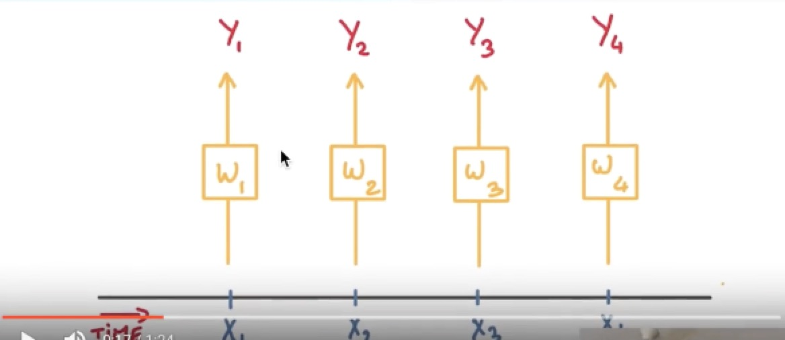

[TOC]

# 学习连接

[一文学会用 Tensorflow 搭建神经网络](https://www.jianshu.com/p/e112012a4b2d)

[莫烦tensorflow](https://morvanzhou.github.io/tutorials/machine-learning/tensorflow/1-1-B-NN/)

[有趣的机器学习-莫烦](https://morvanzhou.github.io/tutorials/machine-learning/ML-intro/)

[Variational Autoencoders Explained](http://kvfrans.com/variational-autoencoders-explained/)

# Tensorflow 简介

## 人工神经网络 VS 生物神经网络

### 二者区别

> 人工神经网络靠的是正向和反向传播来更新神经元, 从而形成一个好的神经系统, 本质上, 这是一个能让计算机处理和优化的数学模型. 而生物神经网络是通过刺激, 产生新的联结, 让信号能够通过新的联结传递而形成反馈

## 神经网络 and 梯度下降

### Optimization

> 学习机器学习的同学们常会遇到这样的图像, 我了个天, 看上去好复杂, 哈哈, 不过还挺好看的. 这些和我们说的梯度下降又有什么关系呢? 原来这些图片展示出来了一个家族的历史, 这个家族的名字就是-”optimization” (优化问题). 优化能力是人类历史上的重大突破, 他解决了很多实际生活中的问题. 从而渐渐演化成了一个庞大的家族.

> 比如说牛顿法 (Newton’s method), 最小二乘法(Least Squares method), 梯度下降法 (Gradient Descent) 等等. 而我们的神经网络就是属于梯度下降法这个分支中的一个. 提到梯度下降, 我们不得不说说大学里面学习过的求导求微分. 因为这就是传说中”梯度下降”里面的”梯度” (gradient)啦. 

### 梯度下降

> 初学神经网络的时候, 我们通常会遇到这样一个方程, 叫做误差方程 (Cost Function). 用来计算预测出来的和我们实际中的值有多大差别. 在预测数值的问题中, 我们常用平方差 (Mean Squared Error) 来代替. 我们简化一下这个方程, W是我们神经网络中的参数, x, y 都是我们的数据, 因为 xy 都是实实在在的数据点, 在这个假设情况中, 是多少都无所谓, 然后我们再厚颜无耻地像这样继续简化一下, (注意, 这个过程在在数学中并不正确, 不过我们只是为了看效果), 所以现在误差值曲线就成了这样. 假设我们初始化的 W 在这个位置. 而这个位置的斜率是这条线, 这也就是梯度下降中的梯度啦. 我们从图中可以看出, Cost 误差最小的时候正是这条 cost 曲线最低的地方, 不过在蓝点的 W 却不知道这件事情, 他目前所知道的就是梯度线为自己在这个位置指出的一个下降方向, 我们就要朝着这个蓝色梯度的方向下降一点点. 在做一条切线, 发现我还能下降, 那我就朝着梯度的方向继续下降, 这时, 再展示出现在的梯度, 因为梯度线已经躺平了, 我们已经指不出哪边是下降的方向了, 所以这时我们就找到了 W 参数的最理想值. 简而言之, 就是找到梯度线躺平的点. 可是神经网络的梯度下降可没这么简单

> 神经网络中的 W 可不止一个, 如果只有一个 W, 我们就能画出之前那样的误差曲线, 如果有两个 W 也简单, 我们可以用一个3D 图来展示, 可是超过3个 W, 我们可就没办法很好的可视化出来啦. 这可不是最要命的. 在通常的神经网络中, 误差曲线可没这么优雅.

### 全局 and 局部最优

> 在简化版的误差曲线中, 我们只要找到梯度线躺平的地方, 就能能迅速找到误差最小时的 W. 可是很多情况是这样的, 误差曲线并不只有一个沟, 而且梯度躺平的点也不止一个. 不同的 W 初始化的位置, 将会带来不同的下降区域. 不同的下降区域, 又会带来不同的 W 解. 在这个图像当中, W 的全局最优解(Global minima)在这个位置, 而其它的 解都是局部最优(Local minima). 全局最优固然是最好, 但是很多时候, 你手中的都是一个局部最优解, 这也是无可避免的. 不过你可以不必担心, 因为虽然不是全局最优, 但是神经网络也能让你的局部最优足够优秀, 以至于即使拿着一个局部最优也能出色的完成手中的任务.

## 科普：神经网络的黑盒不黑

### 黑盒

> 当然, 这可不是人类的神经网络, 因为至今我们都还没彻底弄懂人类复杂神经网络的运行方式. 今天只来说说计算机中的人工神经网络. 我们都听说过, 神经网络是一个黑盒.

> 正好我手边有一个手电筒, 我们打开黑盒好好照亮看看. 一般来说, 神经网络是一连串神经层所组成的把输入进行加工再输出的系统. 中间的加工过程就是我们所谓的黑盒. 想把黑盒打开, 就是把神经网络给拆开. 按正常的逻辑, 我们能将神经网络分成三部分,

### 神经网络分区

> 输入端, 黑盒, 输出端. 输入端是我们能理解的物体, 一个宝宝, 输出端也是一个我们能理解的物体, 一个奶瓶. 对于神经网络, 传统的理解就是, 中间的这两层神经层在对输入信息进行加工, 好让自己的输出信息和奶瓶吻合. 但是我们如果换一个角度来想想. 此时, 我们将左边的红线移动一下

> 现在的输入端增加了一层, 原本我们认定为黑盒的一部分被照亮, 变成了一个已知部分. 我们将最左边两层的神经层共同看成输入端. 貌似怪怪的, 你可能会问: “可是这时的输入端不再是我们知道的”宝宝”了呀, 为什么可以这样看?” 想得没错, 它的确已经不是我们认识的宝宝啦, 但是”宝宝”这个人类定义的形象通过了一层神经网络加工, 变成了另外一种宝宝的形象,可能这种形象我们用肉眼看起来并不像宝宝, 不过计算机却能理解, 这是它所能识别的”宝宝”形象. 在专业术语中, 我们将宝宝当做特征(features), 将神经网络第一层加工后的宝宝叫做代表特征(feature representation). 如果再次移动红线, 我们的黑盒就消失了, 这时原本在黑盒里的所有神经层都被照亮. 原本的代表特征再次被加工, 变成了另一种代表特征, 同样, 再次加工形成的代表特征通常只有计算机自己看得懂, 能够理解. 所以, 与其说黑盒是在加工处理, 还不如说是在将一种代表特征转换成另一种代表特征, 一次次特征之间的转换, 也就是一次次的更有深度的理解. 比如神经网络如果接收人类手写数字的图片.

### 举例

> 然后我们将这个神经网络的输出层给拆掉, 只留下前三层, 那第3层输出的信息就是我们这些数字的3个最重要的代表特征, 换句话说, 就是用3个信息来代表整张手写数字图片的所有像素点. 我们如果把这3个信息展示出来, 我们就能很清楚的看到, 计算机是如何用3个点来代表不同的数字内容, 比如神经网络认为 1 和 0 是完全不同的, 所以他们应该被放在空间里不同的地方. 输出层就更好理解了,

> 有了用3个点表示的数字代表特征, 我们就能整理整理, 将落在相同区域的数字分为一类, 如果落在了那些1所在的区域, 我们就认定张手写图片就是1, 如果是2的区域, 就认定为2. 这就是神经网络的黑盒并不黑的原因啦, 只是因为有时候代表特征太多了,我们人类没有办法看懂他们代表的是什么, 然而计算机却能看清楚它所学到的规律, 所以我们才觉得神经网络就是个黑盒. 这种代表特征的理解方式其实非常有用, 以至于人们拿着它来研究更高级的神经网络玩法. 比如迁移学习(Transfer Learning). 我们举一个例子.

### 迁移学习

> 对于一个有分类能力的神经网络, 有时候我们只需要这套神经网络的理解能力, 并拿这种能力去处理其他问题. 所以我们保留它的代表特征转换能力. 因为有了这种能力, 就能将复杂的图片像素信息转换成更少量, 但更精辟的信息, 比如刚刚我们说将手写数字变成的3个点信息. 然后我们需要干点坏事, 将这个神经网络的输出层给拆掉. 套上另外一个神经网络, 用这种移植的方式再进行训练, 让它处理不同的问题, 比如, 预测照片里事物的价值. 现在看来, 这黑盒里开个灯, 其实还挺有用的嘛. 当你看不懂神经网络的时候, 这样想想, 是不是更好理解啦.

## 神经网络在做什么

### 拟合曲线

> 机器学习 其实就是让电脑不断的尝试模拟已知的数据. 他能知道自己拟合的数据离真实的数据差距有多远, 然后不断地改进自己拟合的参数,提高拟合的相似度.

> 本例中蓝色离散点是我们的数据点, 红线是通过神经网络算法拟合出来的曲线

> 它是对我们数据点的一个近似表达. 可以看出, 在开始阶段, 红线的表达能力不强, 误差很大. 不过通过不断的学习, 预测误差将会被降低. 所以学习到后来. 红线也能近似表达出数据的样子.

### 拟合参数

> 如果红色曲线的表达式为：y = a*x + b 其中x代表inputs, y代表outputs, a和b是神经网络训练的参数. 模型训练好了以后,a和b的值将会被确定, 比如 a=0.5, b=2,当我们再输入x=3时, 我们的模型就会输出 0.5*3 + 2 的结果. 模型通过学习数据, 得到能表达数据的参数, 然后对我们另外给的数据所作出预测.

# tf 基础架构

## 处理结构

### 计算图

> Tensorflow 首先要定义神经网络的结构, 然后再把数据放入结构当中去运算和 training.

> 因为TensorFlow是采用数据流图（data　flow　graphs）来计算, 所以首先我们得创建一个数据流流图, 然后再将我们的数据（数据以张量(tensor)的形式存在）放在数据流图中计算. 节点（Nodes）在图中表示数学操作,图中的线（edges）则表示在节点间相互联系的多维数据数组, 即张量（tensor). 训练模型时tensor会不断的从数据流图中的一个节点flow到另一节点, 这就是TensorFlow名字的由来

### 张量

> 张量（Tensor):

> 张量有多种. 零阶张量为 纯量或标量 (scalar) 也就是一个数值. 比如 [1]
一阶张量为 向量 (vector), 比如 一维的 [1, 2, 3]
二阶张量为 矩阵 (matrix), 比如 二维的 [[1, 2, 3],[4, 5, 6],[7, 8, 9]]
以此类推, 还有 三阶 三维的 …

## activation function（激活函数）

### 非线性方程

> 我们为什么要使用激励函数? 用简单的语句来概括. 就是因为, 现实并没有我们想象的那么美好, 它是残酷多变的. 哈哈, 开个玩笑, 不过激励函数也就是为了解决我们日常生活中 不能用线性方程所概括的问题. 好了,我知道你的问题来了. 什么是线性方程 (linear function)?

> 说到线性方程, 我们不得不提到另外一种方程, 非线性方程 (nonlinear function). 我们假设, 女生长得越漂亮, 越多男生爱. 这就可以被当做一个线性问题. 但是如果我们假设这个场景是发生在校园里. 校园里的男生数是有限的, 女生再漂亮, 也不可能会有无穷多的男生喜欢她. 所以这就变成了一个非线性问题.再说..女生也不可能是无穷漂亮的. 这个问题我们以后有时间私下讨论.

> 然后我们就可以来讨论如何在神经网络中达成我们描述非线性的任务了. 我们可以把整个网络简化成这样一个式子. Y = Wx, W 就是我们要求的参数, y 是预测值, x 是输入值. 用这个式子, 我们很容易就能描述刚刚的那个线性问题, 因为 W 求出来可以是一个固定的数. 不过这似乎并不能让这条直线变得扭起来 , 激励函数见状, 拔刀相助, 站出来说道: “让我来掰弯它!”

### 激活函数

> 这里的 AF 就是指的激励函数. 激励函数拿出自己最擅长的”掰弯利器”, 套在了原函数上 用力一扭, 原来的 Wx 结果就被扭弯了.

> 其实这个 AF, 掰弯利器, 也不是什么触不可及的东西. 它其实就是另外一个非线性函数. 比如说relu, sigmoid, tanh. 将这些掰弯利器嵌套在原有的结果之上, 强行把原有的线性结果给扭曲了. 使得输出结果 y 也有了非线性的特征. 举个例子, 比如我使用了 relu 这个掰弯利器, 如果此时 Wx 的结果是1, y 还将是1, 不过 Wx 为-1的时候, y 不再是-1, 而会是0.

> 你甚至可以创造自己的激励函数来处理自己的问题, 不过要确保的是这些激励函数必须是可以微分的, 因为在 backpropagation 误差反向传递的时候, 只有这些可微分的激励函数才能把误差传递回去.

### 常用选择

> 想要恰当使用这些激励函数, 还是有窍门的. 比如当你的神经网络层只有两三层, 不是很多的时候, 对于隐藏层, 使用任意的激励函数, 随便掰弯是可以的, 不会有特别大的影响. 不过, 当你使用特别多层的神经网络, 在掰弯的时候, 玩玩不得随意选择利器. 因为这会涉及到梯度爆炸, 梯度消失的问题. 因为时间的关系, 我们可能会在以后来具体谈谈这个问题.

> 最后我们说说, 在具体的例子中, 我们默认首选的激励函数是哪些. 在少量层结构中, 我们可以尝试很多种不同的激励函数. 在卷积神经网络 Convolutional neural networks 的卷积层中, 推荐的激励函数是 relu. 在循环神经网络中 recurrent neural networks, 推荐的是 tanh 或者是 relu (这个具体怎么选, 我会在以后 循环神经网络的介绍中在详细讲解).

# 建立第一个神经网络

## 加速神经网络训练

[英文学习资料](http://sebastianruder.com/optimizing-gradient-descent/)

[cs231n](http://cs231n.github.io/neural-networks-3/)

[Ftrl](https://www.eecs.tufts.edu/~dsculley/papers/ad-click-prediction.pdf)

[Module: tf.train](https://www.tensorflow.org/api_docs/python/tf/train)

### Stochastic Gradient Descent (SGD)

> 所以, 最基础的方法就是 SGD 啦, 想像红色方块是我们要训练的 data, 如果用普通的训练方法, 就需要重复不断的把整套数据放入神经网络 NN训练, 这样消耗的计算资源会很大.

> 我们换一种思路, 如果把这些数据拆分成小批小批的, 然后再分批不断放入 NN 中计算, 这就是我们常说的 SGD 的正确打开方式了. 每次使用批数据, 虽然不能反映整体数据的情况, 不过却很大程度上加速了 NN 的训练过程, 而且也不会丢失太多准确率.如果运用上了 SGD, 你还是嫌训练速度慢, 那怎么办?

> 没问题, 事实证明, SGD 并不是最快速的训练方法, 红色的线是 SGD, 但它到达学习目标的时间是在这些方法中最长的一种. 我们还有很多其他的途径来加速训练

### Momentum

> 大多数其他途径是在更新神经网络参数那一步上动动手脚. 传统的参数 W 的更新是把原始的 W 累加上一个负的学习率(learning rate) 乘以校正值 (dx). 这种方法可能会让学习过程曲折无比, 看起来像 喝醉的人回家时, 摇摇晃晃走了很多弯路.

> 所以我们把这个人从平地上放到了一个斜坡上, 只要他往下坡的方向走一点点, 由于向下的惯性, 他不自觉地就一直往下走, 走的弯路也变少了. 这就是 Momentum 参数更新. 另外一种加速方法叫AdaGrad.

### AdaGrad 更新方法

> 这种方法是在学习率上面动手脚, 使得每一个参数更新都会有自己与众不同的学习率, 他的作用和 momentum 类似, 不过不是给喝醉酒的人安排另一个下坡, 而是给他一双不好走路的鞋子, 使得他一摇晃着走路就脚疼, 鞋子成为了走弯路的阻力, 逼着他往前直着走. 他的数学形式是这样的. 接下来又有什么方法呢? 如果把下坡和不好走路的鞋子合并起来, 是不是更好呢? 没错, 这样我们就有了 RMSProp 更新方法

### RMSProp 更新方法

> 有了 momentum 的惯性原则 , 加上 adagrad 的对错误方向的阻力, 我们就能合并成这样. 让 RMSProp同时具备他们两种方法的优势. 不过细心的同学们肯定看出来了, 似乎在 RMSProp 中少了些什么. 原来是我们还没把 Momentum合并完全, RMSProp 还缺少了 momentum 中的 这一部分. 所以, 我们在 Adam 方法中补上了这种想法.

### Adam 更新方法

> 计算m 时有 momentum 下坡的属性, 计算 v 时有 adagrad 阻力的属性, 然后再更新参数时 把 m 和 V 都考虑进去. 实验证明, 大多数时候, 使用 adam 都能又快又好的达到目标, 迅速收敛. 所以说, 在加速神经网络训练的时候, 一个下坡, 一双破鞋子, 功不可没

# tensorboard

# 高阶内容

## CNN

[Google 的 CNN 教程](https://classroom.udacity.com/courses/ud730/lessons/6377263405/concepts/63796332430923)

### 什么是卷积神经网络CNN(Convolutional Neural Network)

> 卷积神经网络是近些年逐步兴起的一种人工神经网络结构, 因为利用卷积神经网络在图像和语音识别方面能够给出更优预测结果, 这一种技术也被广泛的传播可应用. 卷积神经网络最常被应用的方面是计算机的图像识别, 不过因为不断地创新, 它也被应用在视频分析, 自然语言处理, 药物发现, 等等. 近期最火的 Alpha Go, 让计算机看懂围棋, 同样也是有运用到这门技术.

#### 卷积和神经网络

> 我们来具体说说卷积神经网络是如何运作的吧, 举一个识别图片的例子, 我们知道神经网络是由一连串的神经层组成,每一层神经层里面有存在有很多的神经元. 这些神经元就是神经网络识别事物的关键. 每一种神经网络都会有输入输出值, 当输入值是图片的时候, 实际上输入神经网络的并不是那些色彩缤纷的图案,而是一堆堆的数字. 就比如说这个. 当神经网络需要处理这么多输入信息的时候, 也就是卷积神经网络就可以发挥它的优势的时候了. 那什么是卷积神经网络呢?

> 我们先把卷积神经网络这个词拆开来看. “卷积” 和 “神经网络”. ** 卷积也就是说神经网络不再是对每个像素的输入信息做处理了,而是图片上每一小块像素区域进行处理, 这种做法加强了图片信息的连续性. 使得神经网络能看到图形, 而非一个点. 这种做法同时也加深了神经网络对图片的理解. ** 具体来说, 卷积神经网络有一个批量过滤器, 持续不断的在图片上滚动收集图片里的信息,每一次收集的时候都只是收集一小块像素区域, 然后把收集来的信息进行整理, 这时候整理出来的信息有了一些实际上的呈现, 比如这时的神经网络能看到一些边缘的图片信息, 然后在以同样的步骤, 用类似的 ** 批量过滤器扫过产生的这些边缘信息, 神经网络从这些边缘信息里面总结出更高层的信息结构,比如说总结的边缘能够画出眼睛,鼻子 ** 等等. 再经过一次过滤, 脸部的信息也从这些眼睛鼻子的信息中被总结出来. 最后我们再把这些信息套入几层普通的全连接神经层进行分类, 这样就能得到输入的图片能被分为哪一类的结果了.

> 我们截取一段 google 介绍卷积神经网络的视频, 具体说说图片是如何被卷积的. 下面是一张猫的图片, 图片有长, 宽, 高 三个参数. 对! 图片是有高度的! 这里的高指的是计算机用于产生颜色使用的信息. 如果是黑白照片的话, 高的单位就只有1, 如果是彩色照片, 就可能有红绿蓝三种颜色的信息, 这时的高度为3. 我们以彩色照片为例子. 过滤器就是影像中不断移动的东西, 他不断在图片收集小批小批的像素块, 收集完所有信息后, 输出的值, 我们可以理解成是一个 ** 高度更高,长和宽更小的”图片” . 这个图片里就能包含一些边缘信息. 然后以同样的步骤再进行多次卷积, 将图片的长宽再压缩, 高度再增加, 就有了对输入图片更深的理解. 将压缩,增高的信息嵌套在普通的分类神经层上,我们就能对这种图片进行分类了. **

#### 池化(Pooling)

> 研究发现, ** 在每一次卷积的时候, 神经层可能会无意地丢失一些信息. 这时, 池化 (pooling) 就可以很好地解决这一问题. 而且池化是一个筛选过滤的过程, 能将 layer 中有用的信息筛选出来, 给下一个层分析. 同时也减轻了神经网络的计算负担 **  [具体细节参考](http://cs231n.github.io/convolutional-networks/#pool). 也就是说在卷集的时候, 我们不压缩长宽, 尽量地保留更多信息, 压缩的工作就交给池化了,这样的一项附加工作能够很有效的提高准确性. 有了这些技术,我们就可以搭建一个属于我们自己的卷积神经网络啦.

> 卷积神经网络包含输入层、隐藏层和输出层，** 隐藏层又包含卷积层和pooling层，图像输入到卷积神经网络后通过卷积来不断的提取特征，每提取一个特征就会增加一个feature map，所以会看到视频教程中的立方体不断的增加厚度，那么为什么厚度增加了但是却越来越瘦了呢，哈哈这就是pooling层的作用喽，pooling层也就是下采样，通常采用的是最大值pooling和平均值pooling，因为参数太多喽，所以通过pooling来稀疏参数，使我们的网络不至于太复杂 ** 。

#### 流行的 CNN 结构 

> 比较流行的一种搭建结构是这样, 从下到上的顺序, 首先是输入的图片(image), 经过一层卷积层 (convolution), 然后在用池化(pooling)方式处理卷积的信息, 这里使用的是 max pooling 的方式. 然后在经过一次同样的处理, 把得到的第二次处理的信息传入两层全连接的神经层 (fully connected),这也是一般的两层神经网络层,最后在接上一个分类器(classifier)进行分类预测. 这仅仅是对卷积神经网络在图片处理上一次简单的介绍. 如果你想知道使用 python 搭建这样的卷积神经网络, 欢迎点击下面的内容.

## RNN

> 对于序列数据的预测, 顺序排列是很重要. 我们可以预测下一个按照一定顺序排列的字, 但是打乱顺序, 我们就没办法分析自己到底在说什么了

### 学习资料

[rnns-in-tensorflow-a-practical-guide-and-undocumented-features](http://www.wildml.com/2016/08/rnns-in-tensorflow-a-practical-guide-and-undocumented-features/)

[Tensorflow 的 bptt 形式理解](https://r2rt.com/styles-of-truncated-backpropagation.html)

### 什么是循环神经网络RNN(recurrent neural network)

#### 序列数据 

> 我们想象现在有一组序列数据 data 0,1,2,3. 在当预测 result0 的时候,我们基于的是 data0, 同样在预测其他数据的时候, 我们也都只单单基于单个的数据. 每次使用的神经网络都是同一个 NN. 不过这些数据是有关联 顺序的 , 就像在厨房做菜, 酱料 A要比酱料 B 早放, 不然就串味了. 所以普通的神经网络结构并不能让 NN 了解这些数据之间的关联.

#### 处理序列数据的神经网络

> 那我们如何让数据间的关联也被 NN 加以分析呢? 想想我们人类是怎么分析各种事物的关联吧, 最基本的方式,就是记住之前发生的事情. 那我们让神经网络也具备这种记住之前发生的事的能力. 再分析 Data0 的时候, 我们把分析结果存入记忆. 然后当分析 data1的时候, NN会产生新的记忆, 但是新记忆和老记忆是没有联系的. 我们就简单的把老记忆调用过来, 一起分析. 如果继续分析更多的有序数据 , RNN就会把之前的记忆都累积起来, 一起分析

> 我们再重复一遍刚才的流程, 不过这次是以加入一些数学方面的东西. 每次 RNN 运算完之后都会产生一个对于当前状态的描述 , state. 我们用简写 S( t) 代替, 然后这个 RNN开始分析 x(t+1) , 他会根据 x(t+1)产生s(t+1), 不过此时 y(t+1) 是由 s(t) 和 s(t+1) 共同创造的. 所以我们通常看到的 RNN 也可以表达成这种样子.

> 序列数据X1,X2,X3,X4,输出为Y1,Y2,Y3,Y4, W1,W2,W3,W4分别为四个神经网络作为共享的滤波器，因此可以抽象为只有一个，叫做Cell，当扫过X1的时候，会将一部分信息已经存到Cell；当扫过X2的时候，在提取Cell中的X1的记忆信息，此部分记忆和新输入的数据X2，在输出Y2，因此，Y2的输出不仅仅考虑X2，还有上一部分的X1的数据，是对X1和X2的一个总结

### 什么是LSTM循环神经网络

#### RNN弊端

> 之前我们说过, RNN 是在有顺序的数据上进行学习的. 为了记住这些数据, RNN 会像人一样产生对先前发生事件的记忆. 不过一般形式的 RNN 就像一个老爷爷, 有时候比较健忘. 为什么会这样呢?

> 想像现在有这样一个 RNN, 他的输入值是一句话: ‘我今天要做红烧排骨, 首先要准备排骨, 然后…., 最后美味的一道菜就出锅了’, shua ~ 说着说着就流口水了. 现在请 RNN 来分析, 我今天做的到底是什么菜呢. RNN可能会给出“辣子鸡”这个答案. 由于判断失误, RNN就要开始学习 这个长序列 X 和 ‘红烧排骨’ 的关系 , 而RNN需要的关键信息 ”红烧排骨”却出现在句子开头,

> 再来看看 RNN是怎样学习的吧. 红烧排骨这个信息原的记忆要进过长途跋涉才能抵达最后一个时间点. 然后我们得到误差, 而且在 反向传递 得到的误差的时候, 他在每一步都会 乘以一个自己的参数 W. 如果这个 W 是一个小于1 的数, 比如0.9. 这个0.9 不断乘以误差, 误差传到初始时间点也会是一个接近于零的数, 所以对于初始时刻, 误差相当于就消失了. 我们把这个问题叫做梯度消失或者梯度弥散 ** Gradient vanishing ** . 反之如果 W 是一个大于1 的数, 比如1.1 不断累乘, 则到最后变成了无穷大的数, RNN被这无穷大的数撑死了, 这种情况我们叫做剃度爆炸, ** Gradient exploding **. 这就是普通 RNN 没有办法回忆起久远记忆的原因.

### LSTM

> LSTM 是为两解决普通RNN 梯度爆炸和消失问题。
> 输入的时候有一个输入Gate,目的是考虑是否将此input写入到Memory中，Gate是一个参数是可以被训练的;
> 输出的时候是要读取Memory
> 遗忘Gate是考虑是不是要忘记之前的Memory。通过三个门可以很好的控制Gradient vanishing or Gradient exploding

> LSTM 就是为了解决这个问题而诞生的. LSTM 和普通 RNN 相比, 多出了三个控制器. (输入控制, 输出控制, 忘记控制). 现在, LSTM RNN 内部的情况是这样.

> 他多了一个 控制全局的记忆, 我们用粗线代替. 为了方便理解, 我们把粗线想象成电影或游戏当中的 主线剧情. 而原本的 RNN 体系就是 分线剧情. 三个控制器都是在原始的 RNN 体系上, 我们先看 输入方面 , 如果此时的分线剧情对于剧终结果十分重要, 输入控制就会将这个分线剧情按重要程度 写入主线剧情 进行分析. 再看 忘记方面, 如果此时的分线剧情更改了我们对之前剧情的想法, 那么忘记控制就会将之前的某些主线剧情忘记, 按比例替换成现在的新剧情. 所以 主线剧情的更新就取决于输入 和忘记 控制. 最后的输出方面, 输出控制会基于目前的主线剧情和分线剧情判断要输出的到底是什么.基于这些控制机制, LSTM 就像延缓记忆衰退的良药, 可以带来更好的结果.

## AutoEncoder

### 什么是自编码器(AutoEncoder)

Autoencoder 简单来说就是将有很多Feature的数据进行压缩，之后再进行解压的过程。 本质上来说，它也是一个对数据的 ** 非监督学习** ，如果大家知道 PCA (Principal component analysis)， 与 Autoencoder 相类似，它的主要功能即对数据进行非监督学习，并将压缩之后得到的“特征值”，这一中间结果正类似于PCA的结果。 之后再将压缩过的“特征值”进行解压，得到的最终结果与原始数据进行比较，对此进行非监督学习。

#### 压缩与解压

有一个神经网络, 它在做的事情是 接收一张图片, 然后 给它打码, 最后 再从打码后的图片中还原. 太抽象啦? 行, 我们再具体点.

假设刚刚那个神经网络是这样, 对应上刚刚的图片, 可以看出图片其实是经过了压缩,再解压的这一道工序. 当压缩的时候, 原有的图片质量被缩减, 解压时用信息量小却包含了所有关键信息的文件恢复出原本的图片. 为什么要这样做呢?

原来有时神经网络要接受大量的输入信息, 比如输入信息是高清图片时, 输入信息量可能达到上千万, 让神经网络直接从上千万个信息源中学习是一件很吃力的工作. 所以, 何不压缩一下, 提取出原图片中的最具代表性的信息, 缩减输入信息量, 再把缩减过后的信息放进神经网络学习. 这样学习起来就简单轻松了. 所以, 自编码就能在这时发挥作用. 通过将原数据白色的X 压缩, 解压 成黑色的X, 然后通过对比黑白 X ,求出预测误差, 进行反向传递, 逐步提升自编码的准确性. 训练好的自编码中间这一部分就是能总结原数据的精髓. 可以看出, 从头到尾, 我们只用到了输入数据 X, 并没有用到 X 对应的数据标签, 所以也可以说自编码是一种非监督学习. 到了真正使用自编码的时候. 通常只会用到自编码前半部分.

#### 编码器(Encoder)

这 部分也叫作 encoder 编码器. 编码器能得到原数据的精髓, 然后我们只需要再创建一个小的神经网络学习这个精髓的数据,不仅减少了神经网络的负担, 而且同样能达到很好的效果.

这是一个通过自编码整理出来的数据, 他能从原数据中总结出每种类型数据的特征, 如果把这些特征类型都放在一张二维的图片上, 每种类型都已经被很好的用原数据的精髓区分开来. 如果你了解 PCA 主成分分析, 再提取主要特征时, 自编码和它一样,甚至超越了 PCA. 换句话说, 自编码 可以像 PCA 一样 给特征属性降维.

#### 解码器 Decoder

至于解码器 Decoder, 我们也能那它来做点事情. 我们知道, 解码器在训练的时候是要将精髓信息解压成原始信息, 那么这就提供了一个解压器的作用, 甚至我们可以认为是一个生成器 (类似于GAN). 那做这件事的一种特殊自编码叫做 variational autoencoders, 你能在这里找到他的具体说明.

有一个例子就是让它能模仿并生成手写数字.

## Batch Normalization

### 什么是 Batch Normalization

Batch normalization 是一种解决深度神经网络层数太多, 而没办法有效前向传递(forward propagate)的问题. 因为每一层的输出值都会有不同的 均值(mean) 和 方差(deviation), 所以输出数据的分布也不一样, 如下图, 从左到右是每一层的输入数据分布, 上排的没有 Batch normalization, 下排的有 Batch normalization.

### 普通数据标准化

Batch Normalization, 批标准化, 和普通的数据标准化类似, 是将分散的数据统一的一种做法, 也是优化神经网络的一种方法. 在之前 Normalization 的简介视频中我们一提到, ** 具有统一规格的数据, 能让机器学习更容易学习到数据之中的规律. **

### 每层都做标准化

在神经网络中, 数据分布对训练会产生影响. 比如某个神经元 x 的值为1, 某个 Weights 的初始值为 0.1, 这样后一层神经元计算结果就是 Wx = 0.1; 又或者 x = 20, 这样 Wx 的结果就为 2. 现在还不能看出什么问题, 但是, 当我们加上一层激励函数, 激活这个 Wx 值的时候, 问题就来了. 如果使用 像 tanh 的激励函数, Wx 的激活值就变成了 ~0.1 和 ~1, 接近于 1 的部已经处在了 激励函数的饱和阶段, 也就是如果 x 无论再怎么扩大, tanh 激励函数输出值也还是 接近1. 换句话说, 神经网络在初始阶段已经不对那些比较大的 x 特征范围敏感了.  这样很糟糕, 想象我轻轻拍自己的感觉和重重打自己的感觉居然没什么差别, 这就证明我的感官系统失效了. 当然我们是可以用之前提到的对数据做 normalization 预处理, 使得输入的 x 变化范围不会太大, 让输入值经过激励函数的敏感部分. 但刚刚 ** 这个不敏感问题不仅仅发生在神经网络的输入层, 而且在隐藏层中也经常会发生. **

只是时候 x 换到了隐藏层当中, 我们能不能对隐藏层的输入结果进行像之前那样的normalization 处理呢? 答案是可以的, 因为大牛们发明了一种技术, 叫做 batch normalization, 正是处理这种情况.

### BN 添加位置

Batch normalization 的 batch 是批数据, 把数据分成小批小批进行 stochastic gradient descent. 而且在每批数据进行前向传递 forward propagation 的时候, 对每一层都进行 normalization 的处理,

### BN 效果

Batch normalization 也可以被看做一个层面. 在一层层的添加神经网络的时候, 我们先有数据 X, 再添加全连接层, 全连接层的计算结果会经过 激励函数 成为下一层的输入, 接着重复之前的操作. Batch Normalization (BN) 就被添加在每一个全连接和激励函数之间.

之前说过, 计算结果在进入激励函数前的值很重要, 如果我们不单单看一个值, 我们可以说, 计算结果值的分布对于激励函数很重要. 对于数据值大多分布在这个区间的数据, 才能进行更有效的传递. 对比这两个在激活之前的值的分布. 上者没有进行 normalization, 下者进行了 normalization, 这样当然是下者能够更有效地利用 tanh 进行非线性化的过程.

没有 normalize 的数据 使用 tanh 激活以后, 激活值大部分都分布到了饱和阶段, 也就是大部分的激活值不是-1, 就是1, 而 normalize 以后,  ** 大部分的激活值在每个分布区间都还有存在. 再将这个激活后的分布传递到下一层神经网络进行后续计算, 每个区间都有分布的这一种对于神经网络就会更加有价值. ** Batch normalization 不仅仅 normalize 了一下数据, 他还进行了反 normalize 的手续. 为什么要这样呢?

### BN 算法

我们引入一些 batch normalization 的公式. 这三步就是我们在刚刚一直说的 normalization 工序, 但是公式的后面还有一个反向操作, 将 normalize 后的数据再扩展和平移. 原来这是为了让神经网络自己去学着使用和修改这个扩展参数$\gamma$, 和 平移参数$\beta$, 这样神经网络就能自己慢慢琢磨出前面的 normalization 操作到底有没有起到优化的作用, 如果没有起到作用, 我就使用 $\gamma$ 和 $\beta$ 来抵消一些 normalization 的操作.

最后我们来看看一张神经网络训练到最后, 代表了每层输出值的结果的分布图. 这样我们就能一眼看出 Batch normalization 的功效啦. 让每一层的值在有效的范围内传递下去.

[论文：Batch Normalization: Accelerating Deep Network Training by Reducing Internal Covariate Shift](https://arxiv.org/abs/1502.03167)

###

